E-MTAB-11805 scRNA-Seq processing
================
Slim FOURATI
2024-04-29

Load required packages

``` r
suppressPackageStartupMessages(library(package = "knitr"))
# install.packages("hdf5r", configure.args = "--with-hdf5=/opt/homebrew/bin/h5cc")
suppressPackageStartupMessages(library(package = "hdf5r"))
suppressPackageStartupMessages(library(package = "Seurat"))
suppressPackageStartupMessages(library(package = "biomaRt"))
suppressPackageStartupMessages(library(package = "readxl"))
suppressPackageStartupMessages(library(package = "harmony"))
suppressPackageStartupMessages(library(package = "ggpubr"))
suppressPackageStartupMessages(library(package = "tidyverse"))
```

``` r
opts_chunk$set(echo = TRUE, fig.path = "../figure/")
options(readr.show_col_types   = FALSE,
        dplyr.summarise.inform = FALSE)
workDir <- dirname(getwd())
```

``` r
seqFiles <- list.files(path       = file.path(workDir, "input"), 
                       full.names = TRUE,
                       pattern = ".+h5$")
seuratObj <- NULL
for (seqFile in seqFiles) {
    seuratTemp <- Read10X_h5(filename = seqFile)
    sampleId <- gsub(pattern     = "\\..+",
                     replacement = "",
                     basename(seqFile))
    seuratTemp <- CreateSeuratObject(seuratTemp, 
                                     project = sampleId)
    seuratTemp <- RenameCells(seuratTemp,
                              new.names = paste0(sampleId,
                                                 "_",
                                                 colnames(seuratTemp)))
    seuratTemp <- DietSeurat(seuratTemp)

    if (is.null(seuratObj)) {
        seuratObj <- seuratTemp
    } else {
        seuratObj <- merge(x = seuratObj, y = seuratTemp)
        seuratObj <- JoinLayers(seuratObj)
    }
}
save(seuratObj, file = file.path(workDir, "output/e-mtab-11805.seuratObj.RData"))
```

``` r
rm(seuratTemp)
```

# Append meta-data

from ArrayExpress

``` r
aeMetaDF <- read_tsv(file = file.path(workDir, "input/E-MTAB-11805.sdrf.txt")) %>%
  mutate(orig.ident = gsub(pattern = "_S[0-9].+fastq.gz", replacement = "", basename(`Comment[FASTQ_URI]`))) %>%
  select(orig.ident,
         `Characteristics[individual]`,
         `Characteristics[stimulus]`,
         `Characteristics[organism part]`,
         `Characteristics[cell type]`,
         `Comment[library construction]`) %>%
  distinct()

metaDF <- seuratObj@meta.data %>% 
  rowid_to_column() %>%
  merge(y = aeMetaDF, by = "orig.ident", all.x = TRUE) %>%
  arrange(rowid) %>%
  `rownames<-`(value = colnames(seuratObj)) %>%
  select(-rowid) %>%
  setNames(nm = make.names(names(.)))
seuratObj@meta.data <- metaDF
save(seuratObj, file = file.path(workDir, "output/e-mtab-11805.seuratObj.RData"))
```

from Gribonika et al Table S1

``` r
s1DF <- read_excel(path = file.path(workDir, "input/sciimmunol.abc5500_data_file_s1.xlsx"))
```

# Quality control

Percentage of mitochondrial reads

``` r
ensembl <- useMart(biomart = "ensembl", dataset="mmusculus_gene_ensembl")
gene2chr <- getBM(attributes = c("mgi_symbol", "chromosome_name"), 
                  filters = "mgi_symbol", 
                  values = rownames(seuratObj$RNA), 
                  mart = ensembl)

mito.genes <- filter(gene2chr, chromosome_name %in% "MT") %>%
  .$mgi_symbol

percent.mito <- Matrix::colSums(seuratObj[["RNA"]]$counts[mito.genes, ])/
  Matrix::colSums(seuratObj[["RNA"]]$counts)

# AddMetaData adds columns to object@meta.data, and is a great place to
seuratObj <- AddMetaData(object   = seuratObj,
                         metadata = percent.mito,
                         col.name = "percent.mito")
save(seuratObj, file = file.path(workDir, "output/e-mtab-11805.seuratObj.RData"))
```

``` r
ggplot(data    = seuratObj@meta.data,
       mapping = aes(x = orig.ident, y = percent.mito)) +
  geom_boxplot() +
  scale_y_continuous(labels = scales::percent) +
  labs(y = "Percentage of reads that are mitochondrial") +
  theme_bw() + 
  theme(axis.text.x = element_text(angle = 45, hjust = 1))
```

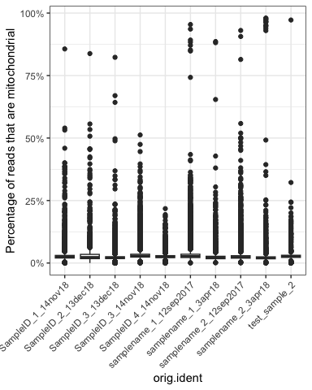<!-- -->

Percent of ribosomal reads

``` r
# look at ribosomal genes
ribo.genes <- grep(pattern = "^Rps|^Rpl", 
                   rownames(x = seuratObj[["RNA"]]$counts), 
                   value   = TRUE)
percent.ribo <- Matrix::colSums(seuratObj[["RNA"]]$counts[ribo.genes, ])/Matrix::colSums(seuratObj[["RNA"]]$counts)

# AddMetaData adds columns to object@meta.data, and is a great place to
seuratObj <- AddMetaData(object   = seuratObj,
                         metadata = percent.ribo,
                         col.name = "percent.ribo")
save(seuratObj, file = file.path(workDir, "output/e-mtab-11805.seuratObj.RData"))
```

``` r
ggplot(data    = seuratObj@meta.data,
       mapping = aes(x = orig.ident, y = percent.ribo)) +
  geom_boxplot() +
  theme_bw() + 
  theme(axis.text.x = element_text(angle = 45, hjust = 1))
```

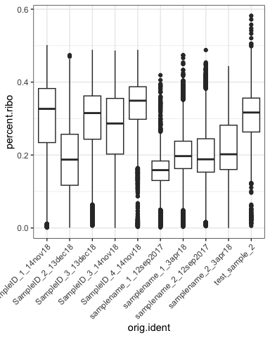<!-- -->

Number of cell detected

``` r
nbCellDF <- table(seuratObj@meta.data$orig.ident) %>%
  as.data.frame() %>%
  rename(orig.ident                  = Var1,
         `Estimated Number of Cells` = Freq)
meanReadsPerCellDF <- colSums(seuratObj[["RNA"]]$counts) %>%
  data.frame(eta = .) %>%
  rownames_to_column() %>%
  mutate(orig.ident = seuratObj@meta.data$orig.ident) %>%
  group_by(orig.ident) %>%
  summarize(`Mean Reads per Cell` = mean(eta))
medianGenesPerCell <- colSums(seuratObj$RNA$counts > 0) %>%
  data.frame(eta = .) %>%
  rownames_to_column() %>%
  mutate(orig.ident = seuratObj@meta.data$orig.ident) %>%
  group_by(orig.ident) %>%
  summarize(`Median Genes per Cell` = median(eta))

plotDF <- merge(x    = nbCellDF,
                y    = meanReadsPerCellDF,
                by   = "orig.ident") %>%
  merge(y  = medianGenesPerCell,
        by = "orig.ident") %>%
  pivot_longer(cols = -orig.ident)

ggplot(data = plotDF,
       mapping = aes(x = orig.ident, y = value)) +
  geom_bar(stat = "identity") +
  facet_grid(rows = ~name, scale = "free", space = "free_x") +
  theme_bw() +
  theme(axis.text.x = element_text(angle = 90, hjust = 1, vjust = 0.5))
```

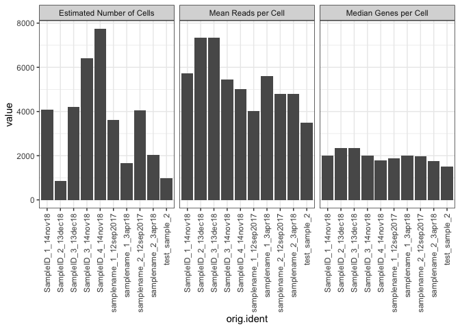

``` r
plotDF %>%
  group_by(name) %>%
  summarize(median  = median(value),
            min     = min(value),
            max     = max(value)) %>%
  rename(metric = name) %>%
  kable()
```

| metric                    |   median |      min |      max |
|:--------------------------|---------:|---------:|---------:|
| Estimated Number of Cells | 3830.500 |  841.000 | 7734.000 |
| Mean Reads per Cell       | 5235.971 | 3487.064 | 7345.313 |
| Median Genes per Cell     | 1987.750 | 1502.000 | 2357.000 |

# Dimension reduction

``` r
DefaultAssay(seuratObj) <- "RNA"
seuratObj <- NormalizeData(seuratObj, verbose = FALSE) %>% 
    FindVariableFeatures(verbose = FALSE) %>% 
    ScaleData(verbose = FALSE) %>% 
    RunPCA(verbose = FALSE)
seuratObj <- RunUMAP(seuratObj, dims = 1:10, n.components = 2L, verbose = FALSE) 
save(seuratObj, file = file.path(workDir, "output/e-mtab-11805.seuratObj.RData"))
```

UMAP with cells colored by sample id

``` r
DimPlot(seuratObj, reduction = "umap")
```

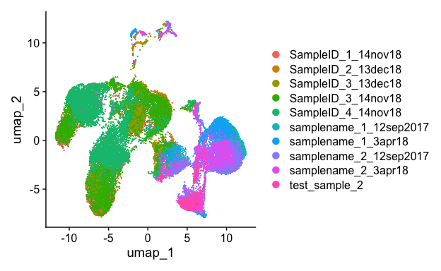<!-- -->

UMAP with cells colored by 3’ or 5’ seq

``` r
DimPlot(seuratObj, reduction = "umap", group.by = "Comment.library.construction.")
```

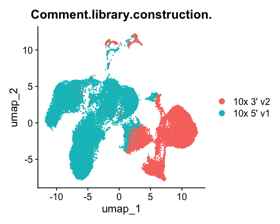<!-- -->

UMAP with cells colored by stim

``` r
DimPlot(seuratObj, reduction = "umap", group.by = "Characteristics.cell.type.", split.by = "Comment.library.construction.")
```

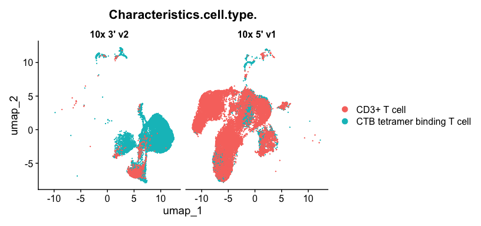<!-- --> Cells segregate by type of
sequencing (5’ vs 3’) and by stimuli (unstim vs Ag-specific). Cells will
be seperated by stim and the harmony method will be used to remove the
technical effect of using different sequencing technology.

# Data integration by CCA T cells

``` r
Idents(seuratObj) <- seuratObj$Characteristics.cell.type.
tcellObj <- subset(seuratObj, ident = "CD3+ T cell")
tcellObj[["RNA"]] <- split(tcellObj[["RNA"]], f = tcellObj$orig.ident)
tcellObj <- NormalizeData(tcellObj, verbose = FALSE)
tcellObj <- FindVariableFeatures(tcellObj, verbose = FALSE)
tcellObj <- ScaleData(tcellObj, verbose = FALSE)
tcellObj <- RunPCA(tcellObj, verbose = FALSE)
tcellObj <- IntegrateLayers(object         = tcellObj, 
                            method         = CCAIntegration, 
                            orig.reduction = "pca", 
                            new.reduction  = "integrated.cca",
                            verbose        = FALSE)

tcellObj[["RNA"]] <- JoinLayers(tcellObj[["RNA"]])
tcellObj <- RunUMAP(tcellObj, dims = 1:10, n.components = 2L, reduction = "integrated.cca", verbose = FALSE)
save(tcellObj, file = file.path(workDir, "output/tcellObj.cca.RData"))
```

UMAP with cells colored by sample id

``` r
DimPlot(tcellObj, reduction = "umap", group.by = "orig.ident")
```

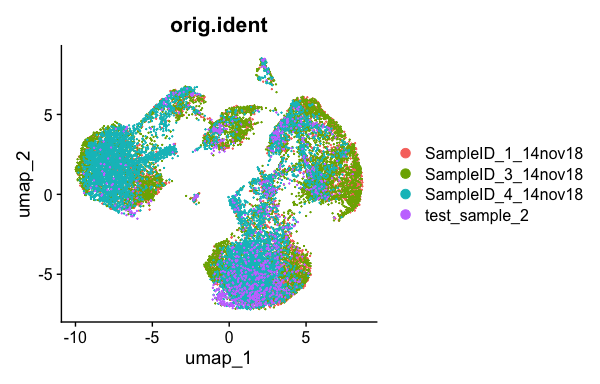<!-- -->

UMAP with cells colored by seq technology

``` r
DimPlot(tcellObj, reduction = "umap", group.by = "Comment.library.construction.")
```

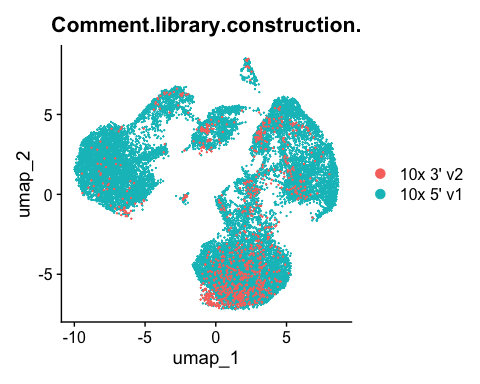<!-- -->

Expression of canonical markers (Cd4, Cd8, Foxp3)

``` r
FeaturePlot(object = tcellObj,
                     features = c("Cd4", "Cd8a", "Cd8b1", "Foxp3"))
```

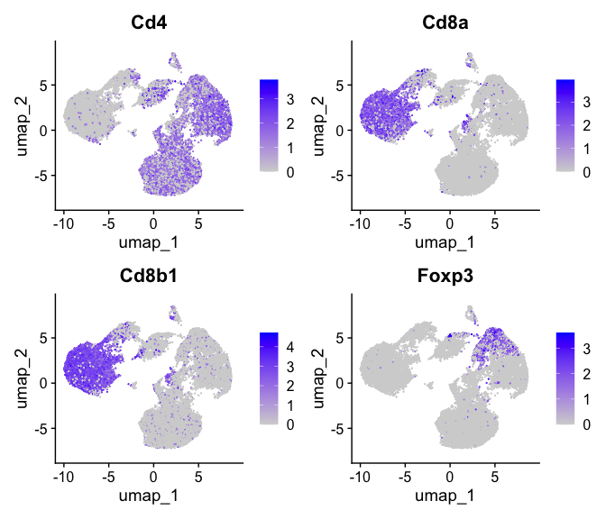
There is a cluster of Foxp3 expressing cells among Cd4 T cells

Identify cluster of Foxp3 expressing cells

``` r
tcellObj <- FindNeighbors(tcellObj, reduction = "umap", dims = 1:2, verbose = FALSE)
tcellObj <- FindClusters(tcellObj, resolution = 0.5, verbose = FALSE)
save(tcellObj, file = file.path(workDir, "output/tcellObj.cca.RData"))
```

``` r
plotTfoxp3 <- FeaturePlot(object = tcellObj, features = "Foxp3") +
  theme(legend.position = "bottom")

plotTcluster <- DimPlot(object = tcellObj, group.by = "seurat_clusters", label = TRUE) +
  theme(legend.position = "none")
ggarrange(plotTfoxp3, plotTcluster, common.legend = TRUE)
```

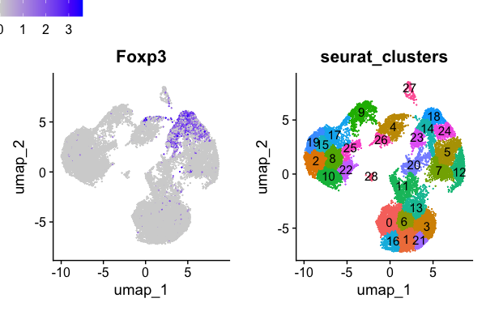
Clusters 14, 18, 23, 24 express Foxp3.

# Extract Foxp3 expressing cells

``` r
# FOXP3 pos: 14, 18, 23, 24
Idents(tcellObj) <- tcellObj$seurat_clusters
foxp3Obj <- subset(tcellObj, idents = c(14, 18, 23, 24)) 
foxp3Obj <- foxp3Obj %>%
  RunPCA(verbose = FALSE) %>%
  RunUMAP(dims = 1:10, n.components = 2L, verbose = FALSE)
save(foxp3Obj, file = file.path(workDir, "output/foxp3Obj.unstim.RData"))
```

``` r
FeaturePlot(foxp3Obj, feature = c("Foxp3", "Cd4", "Il2ra", "Pdcd1", "Cxcr5"))
```

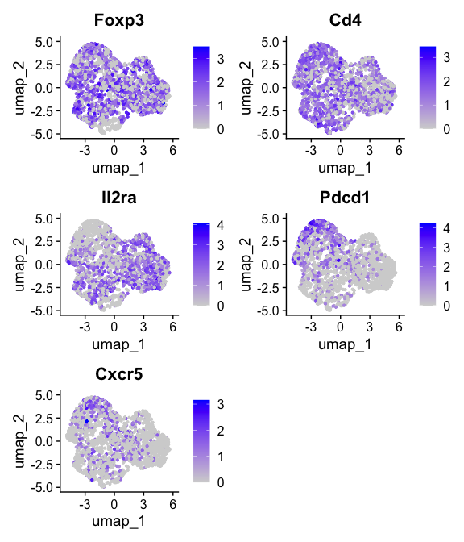<!-- -->

# Identify TFR

Use Le Coz C et al DEG to distinguish Foxp3 cells into Treg and Tfr

``` r
degDF <- read_csv(file = file.path(workDir, "output/gse214572.deg_treg_tfr.csv"))
human <- useMart(biomart = "ensembl", 
                 dataset = "hsapiens_gene_ensembl",
                 host    = "https://dec2021.archive.ensembl.org/")
mouse <- useMart(biomart = "ensembl", 
                 dataset="mmusculus_gene_ensembl",
                 host    = "https://dec2021.archive.ensembl.org/")
human2mouse <- getLDS(mart = human, attributes = "hgnc_symbol", 
                      filters = "hgnc_symbol", values = degDF$values, 
                      attributesL = "mgi_symbol", martL = mouse)

featLS <- merge(x = degDF, y = human2mouse, by.x = "values", by.y = "HGNC.symbol") %>%
  select(MGI.symbol, ind) %>%
  unstack()

foxp3Obj <- AddModuleScore(foxp3Obj,
                            features = featLS,
                            name     = "Module")
foxp3Obj$Tfr_mod <- foxp3Obj$Module1
foxp3Obj$Treg_mod <- foxp3Obj$Module2
foxp3Obj$Module1 <- NULL
foxp3Obj$Module2 <- NULL
save(foxp3Obj, file = file.path(workDir, "output/foxp3Obj.unstim.RData"))
```

UMAP plotting the expression of Tfr and Treg signatures from Le Coz C et
al dataset

``` r
plotTregTfr <- FeaturePlot(foxp3Obj, features = c("Tfr_mod", "Treg_mod"), combine = FALSE)
ggarrange(plotTregTfr[[1]], plotTregTfr[[2]])
```

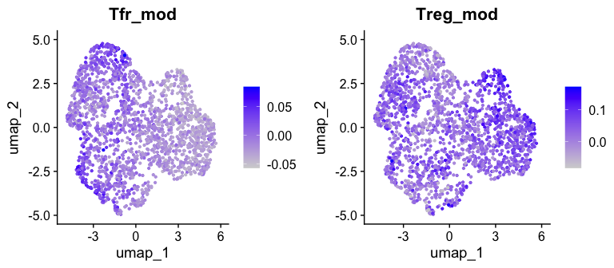<!-- -->

``` r
# look at Flow markers of Tfr
FeaturePlot(foxp3Obj, features = c("Pdcd1", "Cxcr5"))
```

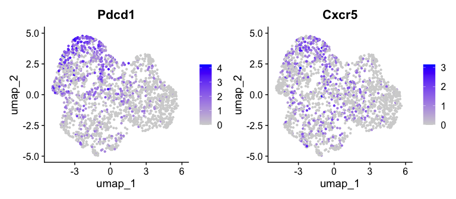<!-- -->

Clustering of Foxp3 expressing cells and seperation of Treg and Tfr

``` r
foxp3Obj <- FindNeighbors(foxp3Obj, reduction = "umap", dims = 1:2, verbose = FALSE)
foxp3Obj <- FindClusters(foxp3Obj, resolution = 0.5, verbose = FALSE)
save(foxp3Obj, file = file.path(workDir, "output/foxp3Obj.unstim.RData"))
```

``` r
plotFoxp3Cluster <- DimPlot(foxp3Obj, group.by = "seurat_clusters", label = TRUE) +
  theme(legend.position = "none")
ggarrange(plotFoxp3Cluster, plotTregTfr[[1]], plotTregTfr[[2]], legend = FALSE, nrow = 1)
```

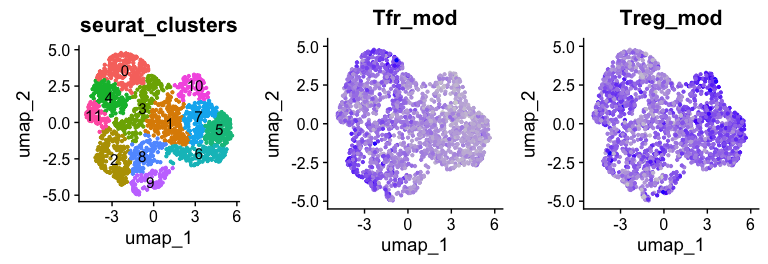
Clusters 1, 5, 6, 7, 10 are Tregs.

Add Treg/Tfr labels

``` r
foxp3Obj <- AddMetaData(foxp3Obj,
                        metadata = ifelse(test = foxp3Obj$seurat_clusters %in% c(1, 5, 6, 7, 10),
                                          yes  = "Treg",
                                          no   = "Tfr"),
                        col.name = "FOXP3_subset")
save(foxp3Obj, file = file.path(workDir, "output/foxp3Obj.unstim.RData"))
```

``` r
DimPlot(foxp3Obj, group.by = "FOXP3_subset", label = TRUE) +
  theme(legend.position = "none")
```

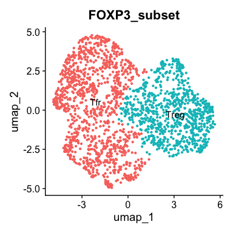<!-- -->

# Data integration by CCA stimulated T

``` r
Idents(seuratObj) <- seuratObj$Characteristics.cell.type.
stimObj <- subset(seuratObj, ident = "CTB tetramer binding T cell")
stimObj[["RNA"]] <- split(stimObj[["RNA"]], f = stimObj$orig.ident)
stimObj <- NormalizeData(stimObj)
stimObj <- FindVariableFeatures(stimObj)
stimObj <- ScaleData(stimObj)
stimObj <- RunPCA(stimObj)
stimObj <- IntegrateLayers(object         = stimObj, 
                            method         = CCAIntegration, 
                            orig.reduction = "pca", 
                            new.reduction  = "integrated.cca")

stimObj[["RNA"]] <- JoinLayers(stimObj[["RNA"]])
stimObj <- RunUMAP(stimObj, dims = 1:10, n.components = 2L, reduction = "integrated.cca")

DimPlot(stimObj, reduction = "umap", group.by = "orig.ident")
DimPlot(stimObj, reduction = "umap", group.by = "Comment.library.construction.")
```

``` r
load(file = file.path(workDir, "data/stimObj.cca.RData"))
```

Expression of canonical markers (CD4, CD8, FOXP3)

``` r
FeaturePlot(object = stimObj,
                     features = c("Cd4", "Cd8a", "Cd8b1", "Foxp3"))
```

``` r
stimObj <- FindNeighbors(stimObj, reduction = "umap", dims = 1:2)
stimObj <- FindClusters(stimObj, resolution = 0.5)

p1 <- FeaturePlot(object = stimObj, features = "Foxp3")

p2 <- DimPlot(object = stimObj, group.by = "seurat_clusters", label = TRUE) +
  theme(legend.position = "none")
ggarrange(p1,p2)

# FOXP3 pos: 12, 15, 18, 22
Idents(stimObj) <- stimObj$seurat_clusters
foxp3stimObj <- subset(stimObj, idents = c(12, 15, 18, 22)) 
foxp3stimObj <- foxp3stimObj %>%
  RunPCA() %>%
  RunUMAP(dims = 1:10, n.components = 2L)

FeaturePlot(foxp3stimObj, feature = c("Foxp3", "Cd4", "Il2ra", "Pdcd1", "Cxcr5"))
```

``` r
featLS <- merge(x = degDF, y = human2mouse, by.x = "values", by.y = "HGNC.symbol") %>%
  select(MGI.symbol, ind) %>%
  unstack()

foxp3stimObj <- AddModuleScore(foxp3stimObj,
                            features = featLS,
                            name     = "Module")
foxp3stimObj$Tfr_mod <- foxp3stimObj$Module1
foxp3stimObj$Treg_mod <- foxp3stimObj$Module2
foxp3stimObj$Module1 <- NULL
foxp3stimObj$Module2 <- NULL

p6 <- FeaturePlot(foxp3stimObj, features = c("Tfr_mod", "Treg_mod"))

FeaturePlot(foxp3stimObj, features = c("Pdcd1", "Cxcr5"))

foxp3stimObj <- FindNeighbors(foxp3stimObj, reduction = "umap", dims = 1:2)
foxp3stimObj <- FindClusters(foxp3stimObj, resolution = 0.5)

p7 <- DimPlot(foxp3stimObj, group.by = "seurat_clusters", label = TRUE) +
  theme(legend.position = "none")
 ggarrange(p7, p6)
 
foxp3stimObj <- AddMetaData(foxp3stimObj,
                        metadata = ifelse(test = foxp3stimObj$seurat_clusters %in% c(1, 3, 4, 6, 14),
                                          yes  = "Tfr",
                                          no   = "Treg"),
                        col.name = "FOXP3_subset")

 DimPlot(foxp3stimObj, group.by = "FOXP3_subset", label = TRUE) +
  theme(legend.position = "none")
```
