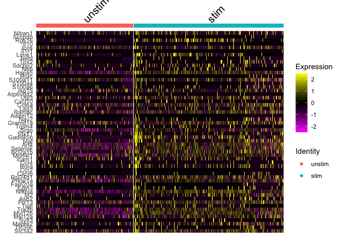
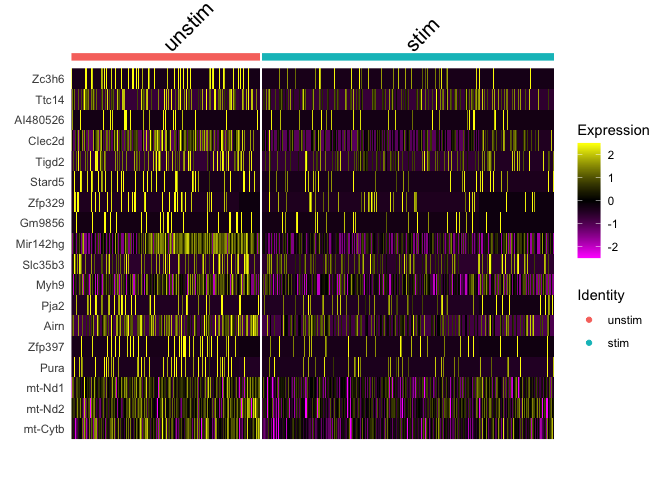
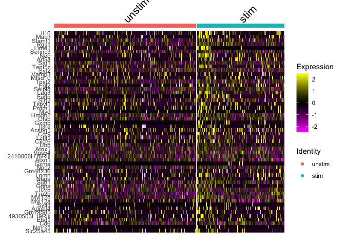
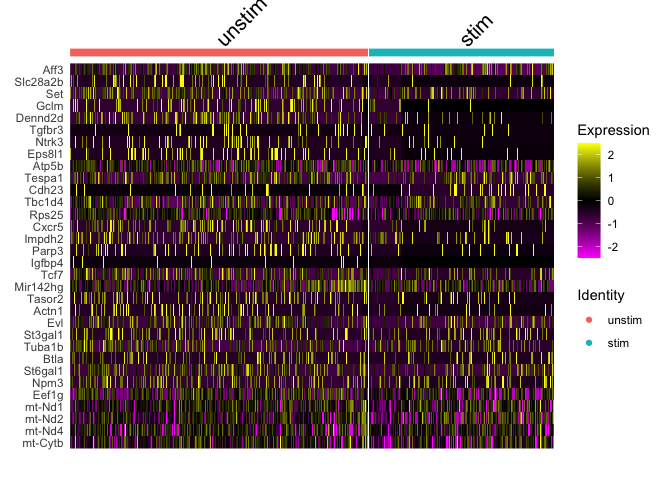

E-MTAB-11805 scRNA-Seq processing
================
Slim FOURATI
2024-04-30

Load required packages

``` r
suppressPackageStartupMessages(library(package = "knitr"))
# install.packages("hdf5r", configure.args = "--with-hdf5=/opt/homebrew/bin/h5cc")
suppressPackageStartupMessages(library(package = "hdf5r"))
suppressPackageStartupMessages(library(package = "Seurat"))
suppressPackageStartupMessages(library(package = "biomaRt"))
suppressPackageStartupMessages(library(package = "readxl"))
suppressPackageStartupMessages(library(package = "harmony"))
suppressPackageStartupMessages(library(package = "ggpubr"))
suppressPackageStartupMessages(library(package = "DESeq2"))
suppressPackageStartupMessages(library(package = "tidyverse"))
```

``` r
opts_chunk$set(echo = TRUE, fig.path = "../figure/")
options(readr.show_col_types   = FALSE,
        dplyr.summarise.inform = FALSE)
workDir <- dirname(getwd())
```

``` r
seqFiles <- list.files(path       = file.path(workDir, "input"), 
                       full.names = TRUE,
                       pattern = ".+h5$")
seuratObj <- NULL
for (seqFile in seqFiles) {
    seuratTemp <- Read10X_h5(filename = seqFile)
    sampleId <- gsub(pattern     = "\\..+",
                     replacement = "",
                     basename(seqFile))
    seuratTemp <- CreateSeuratObject(seuratTemp, 
                                     project = sampleId)
    seuratTemp <- RenameCells(seuratTemp,
                              new.names = paste0(sampleId,
                                                 "_",
                                                 colnames(seuratTemp)))
    seuratTemp <- DietSeurat(seuratTemp)

    if (is.null(seuratObj)) {
        seuratObj <- seuratTemp
    } else {
        seuratObj <- merge(x = seuratObj, y = seuratTemp)
        seuratObj <- JoinLayers(seuratObj)
    }
}
save(seuratObj, file = file.path(workDir, "output/e-mtab-11805.seuratObj.RData"))
```

``` r
rm(seuratTemp)
```

# Append meta-data

from ArrayExpress

``` r
aeMetaDF <- read_tsv(file = file.path(workDir, "input/E-MTAB-11805.sdrf.txt")) %>%
  mutate(orig.ident = gsub(pattern = "_S[0-9].+fastq.gz", replacement = "", basename(`Comment[FASTQ_URI]`))) %>%
  select(orig.ident,
         `Characteristics[individual]`,
         `Characteristics[stimulus]`,
         `Characteristics[organism part]`,
         `Characteristics[cell type]`,
         `Comment[library construction]`) %>%
  distinct()

metaDF <- seuratObj@meta.data %>% 
  rowid_to_column() %>%
  merge(y = aeMetaDF, by = "orig.ident", all.x = TRUE) %>%
  arrange(rowid) %>%
  `rownames<-`(value = colnames(seuratObj)) %>%
  select(-rowid) %>%
  setNames(nm = make.names(names(.)))
seuratObj@meta.data <- metaDF
save(seuratObj, file = file.path(workDir, "output/e-mtab-11805.seuratObj.RData"))
```

from Gribonika et al Table S1

``` r
s1DF <- read_excel(path = file.path(workDir, "input/sciimmunol.abc5500_data_file_s1.xlsx"))
```

# Quality control

Percentage of mitochondrial reads

``` r
ensembl <- useMart(biomart = "ensembl", dataset="mmusculus_gene_ensembl")
gene2chr <- getBM(attributes = c("mgi_symbol", "chromosome_name"), 
                  filters = "mgi_symbol", 
                  values = rownames(seuratObj$RNA), 
                  mart = ensembl)

mito.genes <- filter(gene2chr, chromosome_name %in% "MT") %>%
  .$mgi_symbol

percent.mito <- Matrix::colSums(seuratObj[["RNA"]]$counts[mito.genes, ])/
  Matrix::colSums(seuratObj[["RNA"]]$counts)

# AddMetaData adds columns to object@meta.data, and is a great place to
seuratObj <- AddMetaData(object   = seuratObj,
                         metadata = percent.mito,
                         col.name = "percent.mito")
save(seuratObj, file = file.path(workDir, "output/e-mtab-11805.seuratObj.RData"))
```

``` r
ggplot(data    = seuratObj@meta.data,
       mapping = aes(x = orig.ident, y = percent.mito)) +
  geom_boxplot() +
  scale_y_continuous(labels = scales::percent) +
  labs(y = "Percentage of reads that are mitochondrial") +
  theme_bw() + 
  theme(axis.text.x = element_text(angle = 45, hjust = 1))
```

<!-- -->

Percent of ribosomal reads

``` r
# look at ribosomal genes
ribo.genes <- grep(pattern = "^Rps|^Rpl", 
                   rownames(x = seuratObj[["RNA"]]$counts), 
                   value   = TRUE)
percent.ribo <- Matrix::colSums(seuratObj[["RNA"]]$counts[ribo.genes, ])/Matrix::colSums(seuratObj[["RNA"]]$counts)

# AddMetaData adds columns to object@meta.data, and is a great place to
seuratObj <- AddMetaData(object   = seuratObj,
                         metadata = percent.ribo,
                         col.name = "percent.ribo")
save(seuratObj, file = file.path(workDir, "output/e-mtab-11805.seuratObj.RData"))
```

``` r
ggplot(data    = seuratObj@meta.data,
       mapping = aes(x = orig.ident, y = percent.ribo)) +
  geom_boxplot() +
  theme_bw() + 
  theme(axis.text.x = element_text(angle = 45, hjust = 1))
```

<!-- -->

Number of cell detected

``` r
nbCellDF <- table(seuratObj@meta.data$orig.ident) %>%
  as.data.frame() %>%
  rename(orig.ident                  = Var1,
         `Estimated Number of Cells` = Freq)
meanReadsPerCellDF <- colSums(seuratObj[["RNA"]]$counts) %>%
  data.frame(eta = .) %>%
  rownames_to_column() %>%
  mutate(orig.ident = seuratObj@meta.data$orig.ident) %>%
  group_by(orig.ident) %>%
  summarize(`Mean Reads per Cell` = mean(eta))
medianGenesPerCell <- colSums(seuratObj$RNA$counts > 0) %>%
  data.frame(eta = .) %>%
  rownames_to_column() %>%
  mutate(orig.ident = seuratObj@meta.data$orig.ident) %>%
  group_by(orig.ident) %>%
  summarize(`Median Genes per Cell` = median(eta))

plotDF <- merge(x    = nbCellDF,
                y    = meanReadsPerCellDF,
                by   = "orig.ident") %>%
  merge(y  = medianGenesPerCell,
        by = "orig.ident") %>%
  pivot_longer(cols = -orig.ident)

ggplot(data = plotDF,
       mapping = aes(x = orig.ident, y = value)) +
  geom_bar(stat = "identity") +
  facet_grid(rows = ~name, scale = "free", space = "free_x") +
  theme_bw() +
  theme(axis.text.x = element_text(angle = 90, hjust = 1, vjust = 0.5))
```


``` r
plotDF %>%
  group_by(name) %>%
  summarize(median  = median(value),
            min     = min(value),
            max     = max(value)) %>%
  rename(metric = name) %>%
  kable()
```

| metric                    |   median |      min |      max |
|:--------------------------|---------:|---------:|---------:|
| Estimated Number of Cells | 3830.500 |  841.000 | 7734.000 |
| Mean Reads per Cell       | 5235.971 | 3487.064 | 7345.313 |
| Median Genes per Cell     | 1987.750 | 1502.000 | 2357.000 |

# Dimension reduction

``` r
DefaultAssay(seuratObj) <- "RNA"
seuratObj <- NormalizeData(seuratObj, verbose = FALSE) %>% 
    FindVariableFeatures(verbose = FALSE) %>% 
    ScaleData(verbose = FALSE) %>% 
    RunPCA(verbose = FALSE)
seuratObj <- RunUMAP(seuratObj, dims = 1:10, n.components = 2L, verbose = FALSE) 
save(seuratObj, file = file.path(workDir, "output/e-mtab-11805.seuratObj.RData"))
```

UMAP with cells colored by sample id

``` r
DimPlot(seuratObj, reduction = "umap")
```

<!-- -->

UMAP with cells colored by 3’ or 5’ seq

``` r
DimPlot(seuratObj, reduction = "umap", group.by = "Comment.library.construction.")
```

<!-- -->

UMAP with cells colored by stim

``` r
DimPlot(seuratObj, reduction = "umap", group.by = "Characteristics.cell.type.", split.by = "Comment.library.construction.")
```

<!-- --> Cells segregate by type of
sequencing (5’ vs 3’) and by stimuli (unstim vs Ag-specific). Cells will
be seperated by stim and the harmony method will be used to remove the
technical effect of using different sequencing technology.

# Data integration by CCA T cells

``` r
Idents(seuratObj) <- seuratObj$Characteristics.cell.type.
tcellObj <- subset(seuratObj, ident = "CD3+ T cell")
tcellObj[["RNA"]] <- split(tcellObj[["RNA"]], f = tcellObj$orig.ident)
tcellObj <- NormalizeData(tcellObj, verbose = FALSE)
tcellObj <- FindVariableFeatures(tcellObj, verbose = FALSE)
tcellObj <- ScaleData(tcellObj, verbose = FALSE)
tcellObj <- RunPCA(tcellObj, verbose = FALSE)
tcellObj <- IntegrateLayers(object         = tcellObj, 
                            method         = CCAIntegration, 
                            orig.reduction = "pca", 
                            new.reduction  = "integrated.cca",
                            verbose        = FALSE)

tcellObj[["RNA"]] <- JoinLayers(tcellObj[["RNA"]])
tcellObj <- RunUMAP(tcellObj, dims = 1:10, n.components = 2L, reduction = "integrated.cca", verbose = FALSE)
save(tcellObj, file = file.path(workDir, "output/tcellObj.cca.RData"))
```

UMAP with cells colored by sample id

``` r
DimPlot(tcellObj, reduction = "umap", group.by = "orig.ident")
```

<!-- -->

UMAP with cells colored by seq technology

``` r
DimPlot(tcellObj, reduction = "umap", group.by = "Comment.library.construction.")
```

<!-- -->

Expression of canonical markers (Cd4, Cd8, Foxp3)

``` r
FeaturePlot(object = tcellObj,
                     features = c("Cd4", "Cd8a", "Cd8b1", "Foxp3"))
```


There is a cluster of Foxp3 expressing cells among Cd4 T cells

Identify cluster of Foxp3 expressing cells

``` r
tcellObj <- FindNeighbors(tcellObj, reduction = "umap", dims = 1:2, verbose = FALSE)
tcellObj <- FindClusters(tcellObj, resolution = 0.5, verbose = FALSE)
save(tcellObj, file = file.path(workDir, "output/tcellObj.cca.RData"))
```

``` r
plotTfoxp3 <- FeaturePlot(object = tcellObj, features = "Foxp3") +
  theme(legend.position = "bottom")

plotTcluster <- DimPlot(object = tcellObj, group.by = "seurat_clusters", label = TRUE) +
  theme(legend.position = "none")
ggarrange(plotTfoxp3, plotTcluster, common.legend = TRUE)
```


Clusters 14, 18, 23, 24 express Foxp3.

# Extract Foxp3 expressing cells

``` r
# FOXP3 pos: 14, 18, 23, 24
Idents(tcellObj) <- tcellObj$seurat_clusters
foxp3Obj <- subset(tcellObj, idents = c(14, 18, 23, 24)) 
foxp3Obj <- foxp3Obj %>%
  RunPCA(verbose = FALSE) %>%
  RunUMAP(dims = 1:10, n.components = 2L, verbose = FALSE)
save(foxp3Obj, file = file.path(workDir, "output/foxp3Obj.unstim.RData"))
```

``` r
FeaturePlot(foxp3Obj, feature = c("Foxp3", "Cd4", "Il2ra", "Pdcd1", "Cxcr5"))
```

<!-- -->

# Identify TFR

Use Le Coz C et al DEG to distinguish Foxp3 cells into Treg and Tfr

``` r
degDF <- read_csv(file = file.path(workDir, "output/gse214572.deg_treg_tfr.csv"))
human <- useMart(biomart = "ensembl", 
                 dataset = "hsapiens_gene_ensembl",
                 host    = "https://dec2021.archive.ensembl.org/")
mouse <- useMart(biomart = "ensembl", 
                 dataset="mmusculus_gene_ensembl",
                 host    = "https://dec2021.archive.ensembl.org/")
human2mouse <- getLDS(mart = human, attributes = "hgnc_symbol", 
                      filters = "hgnc_symbol", values = degDF$values, 
                      attributesL = "mgi_symbol", martL = mouse)

featLS <- merge(x = degDF, y = human2mouse, by.x = "values", by.y = "HGNC.symbol") %>%
  select(MGI.symbol, ind) %>%
  unstack()

foxp3Obj <- AddModuleScore(foxp3Obj,
                            features = featLS,
                            name     = "Module")
foxp3Obj$Tfr_mod <- foxp3Obj$Module1
foxp3Obj$Treg_mod <- foxp3Obj$Module2
foxp3Obj$Module1 <- NULL
foxp3Obj$Module2 <- NULL
save(foxp3Obj, file = file.path(workDir, "output/foxp3Obj.unstim.RData"))
```

UMAP plotting the expression of Tfr and Treg signatures from Le Coz C et
al dataset

``` r
plotTregTfr <- FeaturePlot(foxp3Obj, features = c("Tfr_mod", "Treg_mod"), combine = FALSE)
ggarrange(plotTregTfr[[1]], plotTregTfr[[2]])
```

<!-- -->

``` r
# look at Flow markers of Tfr
FeaturePlot(foxp3Obj, features = c("Pdcd1", "Cxcr5"))
```

<!-- -->

Clustering of Foxp3 expressing cells and seperation of Treg and Tfr

``` r
foxp3Obj <- FindNeighbors(foxp3Obj, reduction = "umap", dims = 1:2, verbose = FALSE)
foxp3Obj <- FindClusters(foxp3Obj, resolution = 0.5, verbose = FALSE)
save(foxp3Obj, file = file.path(workDir, "output/foxp3Obj.unstim.RData"))
```

``` r
plotFoxp3Cluster <- DimPlot(foxp3Obj, group.by = "seurat_clusters", label = TRUE) +
  theme(legend.position = "none")
ggarrange(plotFoxp3Cluster, plotTregTfr[[1]], plotTregTfr[[2]], legend = FALSE, nrow = 1)
```


Clusters 1, 5, 6, 7, 10 are Tregs.

Add Treg/Tfr labels

``` r
foxp3Obj <- AddMetaData(foxp3Obj,
                        metadata = ifelse(test = foxp3Obj$seurat_clusters %in% c(1, 5, 6, 7, 10),
                                          yes  = "Treg",
                                          no   = "Tfr"),
                        col.name = "FOXP3_subset")
save(foxp3Obj, file = file.path(workDir, "output/foxp3Obj.unstim.RData"))
```

``` r
DimPlot(foxp3Obj, group.by = "FOXP3_subset", label = TRUE) +
  theme(legend.position = "none")
```

<!-- -->

# Data integration by CCA stimulated T

``` r
Idents(seuratObj) <- seuratObj$Characteristics.cell.type.
stimObj <- subset(seuratObj, ident = "CTB tetramer binding T cell")
stimObj[["RNA"]] <- split(stimObj[["RNA"]], f = stimObj$orig.ident)
stimObj <- NormalizeData(stimObj, verbose = FALSE)
stimObj <- FindVariableFeatures(stimObj, verbose = FALSE)
stimObj <- ScaleData(stimObj, verbose = FALSE)
stimObj <- RunPCA(stimObj, verbose = FALSE)
stimObj <- IntegrateLayers(object         = stimObj, 
                            method         = CCAIntegration, 
                            orig.reduction = "pca", 
                            new.reduction  = "integrated.cca",
                            verbose = FALSE)

stimObj[["RNA"]] <- JoinLayers(stimObj[["RNA"]])
stimObj <- RunUMAP(stimObj, dims = 1:10, n.components = 2L, reduction = "integrated.cca", verbose = FALSE)
save(stimObj, file = file.path(workDir, "output/stimObj.cca.RData"))
```

UMAP with cells colored by sample id

``` r
DimPlot(stimObj, reduction = "umap", group.by = "orig.ident")
```

<!-- -->

UMAP with cells colored by seq technology

``` r
DimPlot(stimObj, reduction = "umap", group.by = "Comment.library.construction.")
```

<!-- -->

Expression of canonical markers (Cd4, Cd8, Foxp3)

``` r
FeaturePlot(object   = stimObj,
            features = c("Cd4", "Cd8a", "Cd8b1", "Foxp3"))
```


There is a cluster of Foxp3 expressing cells among T cells

Identify cluster of Foxp3 expressing cells

``` r
stimObj <- FindNeighbors(stimObj, reduction = "umap", dims = 1:2, verbose = FALSE)
stimObj <- FindClusters(stimObj, resolution = 0.5, verbose = FALSE)
save(stimObj, file = file.path(workDir, "output/stimObj.cca.RData"))
```

``` r
plotStimfoxp3 <- FeaturePlot(object = stimObj, features = "Foxp3") +
  theme(legend.position = "bottom")

plotStimcluster <- DimPlot(object = stimObj, group.by = "seurat_clusters", label = TRUE) +
  theme(legend.position = "none")
ggarrange(plotStimfoxp3, plotStimcluster, common.legend = TRUE)
```


Clusters 12, 15, 18, 22 express Foxp3.

# Extract Foxp3 expressing cells

``` r
# FOXP3 pos: 12, 15, 18, 22
Idents(stimObj) <- stimObj$seurat_clusters
foxp3stimObj <- subset(stimObj, idents = c(12, 15, 18, 22)) 
foxp3stimObj <- foxp3stimObj %>%
  RunPCA(verbose = FALSE) %>%
  RunUMAP(dims = 1:10, n.components = 2L, verbose = FALSE)
save(foxp3stimObj, file = file.path(workDir, "output/foxp3Obj.stim.RData"))
```

``` r
FeaturePlot(foxp3stimObj, feature = c("Foxp3", "Cd4", "Il2ra", "Pdcd1", "Cxcr5"))
```

<!-- -->

# Identify TFR

Use Le Coz C et al DEG to distinguish Foxp3 cells into Treg and Tfr

``` r
degDF <- read_csv(file = file.path(workDir, "output/gse214572.deg_treg_tfr.csv"))
human <- useMart(biomart = "ensembl", 
                 dataset = "hsapiens_gene_ensembl",
                 host    = "https://dec2021.archive.ensembl.org/")
mouse <- useMart(biomart = "ensembl", 
                 dataset="mmusculus_gene_ensembl",
                 host    = "https://dec2021.archive.ensembl.org/")
human2mouse <- getLDS(mart = human, attributes = "hgnc_symbol", 
                      filters = "hgnc_symbol", values = degDF$values, 
                      attributesL = "mgi_symbol", martL = mouse)

featLS <- merge(x = degDF, y = human2mouse, by.x = "values", by.y = "HGNC.symbol") %>%
  select(MGI.symbol, ind) %>%
  unstack()

foxp3stimObj <- AddModuleScore(foxp3stimObj,
                            features = featLS,
                            name     = "Module")
foxp3stimObj$Tfr_mod <- foxp3stimObj$Module1
foxp3stimObj$Treg_mod <- foxp3stimObj$Module2
foxp3stimObj$Module1 <- NULL
foxp3stimObj$Module2 <- NULL
save(foxp3stimObj, file = file.path(workDir, "output/foxp3Obj.stim.RData"))
```

UMAP plotting the expression of Tfr and Treg signatures from Le Coz C et
al dataset

``` r
plotStimTregTfr <- FeaturePlot(foxp3stimObj, features = c("Tfr_mod", "Treg_mod"), combine = FALSE)
ggarrange(plotStimTregTfr[[1]], plotStimTregTfr[[2]])
```

<!-- -->

``` r
# look at Flow markers of Tfr
FeaturePlot(foxp3stimObj, features = c("Pdcd1", "Cxcr5"))
```

<!-- -->

Clustering of Foxp3 expressing cells and seperation of Treg and Tfr

``` r
foxp3stimObj <- FindNeighbors(foxp3stimObj, reduction = "umap", dims = 1:2, verbose = FALSE)
foxp3stimObj <- FindClusters(foxp3stimObj, resolution = 0.5, verbose = FALSE)
save(foxp3stimObj, file = file.path(workDir, "output/foxp3Obj.stim.RData"))
```

``` r
plotStimFoxp3Cluster <- DimPlot(foxp3stimObj, group.by = "seurat_clusters", label = TRUE) +
  theme(legend.position = "none")
ggarrange(plotStimFoxp3Cluster, plotStimTregTfr[[1]], plotStimTregTfr[[2]], legend = FALSE, nrow = 1)
```


Clusters 1, 3, 4, 6, 14 are Tfrs.

Add Treg/Tfr labels

``` r
foxp3stimObj <- AddMetaData(foxp3stimObj,
                            metadata = ifelse(test = foxp3stimObj$seurat_clusters %in% c(1, 3, 4, 6, 14),
                                              yes  = "Tfr",
                                              no   = "Treg"),
                            col.name = "FOXP3_subset")
save(foxp3stimObj, file = file.path(workDir, "output/foxp3Obj.stim.RData"))
```

``` r
DimPlot(foxp3stimObj, group.by = "FOXP3_subset", label = TRUE) +
  theme(legend.position = "none")
```

<!-- -->

# Differential expression

``` r
pseudobulkDF <- NULL
for (SUBSET in unique(foxp3Obj$FOXP3_subset)) {
  for (SAMPLE in unique(foxp3Obj$orig.ident)) {
    seuratTemp <- subset(foxp3Obj,
      subset = orig.ident == SAMPLE &
        FOXP3_subset == SUBSET)
    pseudobulkDF <- cbind(pseudobulkDF, 
                          Matrix::rowSums(seuratTemp$RNA$counts))
    colnames(pseudobulkDF)[ncol(pseudobulkDF)] <- paste0(SAMPLE, ".", SUBSET)
  }
}
for (SUBSET in unique(foxp3stimObj$FOXP3_subset)) {
  for (SAMPLE in unique(foxp3stimObj$orig.ident)) {
    seuratTemp <- subset(foxp3stimObj,
      subset = orig.ident == SAMPLE &
        FOXP3_subset == SUBSET)
    pseudobulkDF <- cbind(pseudobulkDF, 
                          Matrix::rowSums(seuratTemp$RNA$counts))
    colnames(pseudobulkDF)[ncol(pseudobulkDF)] <- paste0(SAMPLE, ".", SUBSET)
  }
}
cdataDF <- strsplit(colnames(pseudobulkDF), split = "\\.") %>%
  do.call(what = rbind) %>%
  as.data.frame() %>%
  setNames(nm = c("orig.ident", "FOXP3_subset")) %>%
  mutate(rowname = colnames(pseudobulkDF)) %>%
  merge(y = distinct(select(seuratObj@meta.data,
                            orig.ident,
                            Characteristics.stimulus.,
                            Comment.library.construction.)),
        by = "orig.ident",
        all.x = TRUE) %>%
  mutate(Characteristics.stimulus. = ifelse(test = Characteristics.stimulus. == "No pretreatment",
                                            yes  = "unstim",
                                            no   = "stim"),
         goi = paste0(FOXP3_subset, ".", Characteristics.stimulus.),
         goi = factor(goi),
         goi = relevel(goi, ref = "Treg.unstim"),
         Comment.library.construction. = make.names(Comment.library.construction.),
         Comment.library.construction. = factor(Comment.library.construction.)) %>%
  slice(match(colnames(pseudobulkDF), table = .$rowname)) %>%
  column_to_rownames(var = "rowname")
dds <- DESeqDataSetFromMatrix(countData = pseudobulkDF,
                              colData   = cdataDF,
                              design    = ~Comment.library.construction.+goi)
dds <- DESeq(dds, quiet = TRUE)
# resultsNames(dds) # lists the coefficients
res <- results(dds, name="goi_Treg.stim_vs_Treg.unstim")
degTreg <- filter(as.data.frame(res), padj <= 0.05)
# write deg file
degTreg %>%
  rownames_to_column(var = "gene_name") %>%
  write_csv(file = file.path(workDir, "output/e-mtab-11805.deg_treg_stim_vs_unstim.csv"))
cdataDF <- cdataDF %>%
  mutate(goi = relevel(goi, ref = "Tfr.unstim"))
dds <- DESeqDataSetFromMatrix(countData = pseudobulkDF,
                              colData   = cdataDF,
                              design    = ~Comment.library.construction.+goi)
dds <- DESeq(dds, quiet = TRUE)
# resultsNames(dds) # lists the coefficients
res <- results(dds, name="goi_Tfr.stim_vs_Tfr.unstim")
degTfr <- filter(as.data.frame(res), padj <= 0.05)
# write deg file
degTfr %>%
  rownames_to_column(var = "gene_name") %>%
  write_csv(file = file.path(workDir, "output/e-mtab-11805.deg_tfr_stim_vs_unstim.csv"))
```

List DEGs

``` r
message("Genes induced in Treg after Ag stim:")
```

    ## Genes induced in Treg after Ag stim:

``` r
degTreg %>%
  rownames_to_column(var = "gene_name") %>% 
  filter(log2FoldChange > 0) %>%
  kable()
```

| gene_name |   baseMean | log2FoldChange |     lfcSE |     stat |    pvalue |      padj |
|:----------|-----------:|---------------:|----------:|---------:|----------:|----------:|
| Niban1    |  73.600637 |      1.2882405 | 0.3262167 | 3.949033 | 0.0000785 | 0.0151987 |
| Sccpdh    |  31.171273 |      3.9370990 | 0.9402065 | 4.187483 | 0.0000282 | 0.0075648 |
| Rgs16     |  31.916101 |      2.0759498 | 0.5832886 | 3.559044 | 0.0003722 | 0.0376515 |
| Il10      |  78.865878 |      5.6835406 | 1.1347468 | 5.008642 | 0.0000005 | 0.0006201 |
| Icos      | 290.244993 |      1.6149010 | 0.3523980 | 4.582605 | 0.0000046 | 0.0023607 |
| Il1r1     |   9.785160 |      5.7366853 | 1.4674201 | 3.909368 | 0.0000925 | 0.0161317 |
| Lime1     |  11.113747 |      1.7317038 | 0.4047730 | 4.278210 | 0.0000188 | 0.0062559 |
| Nebl      |  20.679405 |      2.4364128 | 0.6798807 | 3.583589 | 0.0003389 | 0.0374705 |
| Tox2      |  41.844073 |      3.2265781 | 0.7344052 | 4.393457 | 0.0000112 | 0.0040156 |
| Sdcbp2    |  32.058476 |      1.2134437 | 0.3284856 | 3.694054 | 0.0002207 | 0.0290375 |
| Neb       |  35.126776 |      1.6978494 | 0.4778513 | 3.553092 | 0.0003807 | 0.0376515 |
| Hspa5     | 254.788161 |      1.3746035 | 0.3077932 | 4.465998 | 0.0000080 | 0.0034733 |
| Rorc      |  16.606466 |      4.1510587 | 1.0748201 | 3.862096 | 0.0001124 | 0.0191193 |
| S100a11   | 269.154208 |      1.7850471 | 0.3771309 | 4.733230 | 0.0000022 | 0.0014661 |
| S100a4    |  34.949338 |      5.4157970 | 1.1835240 | 4.575992 | 0.0000047 | 0.0023607 |
| S100a6    | 128.035399 |      3.4002428 | 0.5406852 | 6.288766 | 0.0000000 | 0.0000011 |
| Isg15     | 103.873653 |      1.2215747 | 0.3488780 | 3.501438 | 0.0004628 | 0.0442026 |
| Atp6v0d2  |  37.124950 |      2.6959653 | 0.6870458 | 3.923996 | 0.0000871 | 0.0159234 |
| Ubl3      |  78.276923 |      1.3731130 | 0.3385865 | 4.055428 | 0.0000500 | 0.0112564 |
| Cxcl10    |  16.190862 |      3.5760282 | 0.9815543 | 3.643230 | 0.0002692 | 0.0335249 |
| Cct6a     |  56.301660 |      0.6300436 | 0.1535937 | 4.102014 | 0.0000410 | 0.0096765 |
| Lag3      | 193.370208 |      1.5485264 | 0.4147328 | 3.733793 | 0.0001886 | 0.0263046 |
| Ramac     |  67.249758 |      0.5728592 | 0.1596199 | 3.588896 | 0.0003321 | 0.0374705 |
| Adam12    |  19.021513 |      3.7982796 | 1.0048636 | 3.779896 | 0.0001569 | 0.0232771 |
| Nav2      |  70.369076 |      3.4788484 | 0.5119863 | 6.794807 | 0.0000000 | 0.0000001 |
| Gramd1a   |  60.297420 |      0.6579342 | 0.1841509 | 3.572798 | 0.0003532 | 0.0376515 |
| Trpm4     |   9.070506 |      1.6915722 | 0.4432480 | 3.816311 | 0.0001355 | 0.0219668 |
| Srgn      | 930.931560 |      0.9616571 | 0.2599621 | 3.699221 | 0.0002163 | 0.0290375 |
| Stx11     |  48.366843 |      2.4638250 | 0.6278520 | 3.924213 | 0.0000870 | 0.0159234 |
| Gadd45b   | 168.120868 |      3.6433844 | 0.7442335 | 4.895485 | 0.0000010 | 0.0007598 |
| Maf       | 232.620918 |      1.8881997 | 0.4562456 | 4.138560 | 0.0000349 | 0.0087036 |
| Arf4      | 197.855761 |      1.4149671 | 0.3840600 | 3.684235 | 0.0002294 | 0.0296211 |
| Selenok   | 156.668291 |      0.6141649 | 0.1540756 | 3.986126 | 0.0000672 | 0.0133804 |
| Bcl2a1b   |  98.443161 |      1.3605459 | 0.3904912 | 3.484191 | 0.0004936 | 0.0465143 |
| Morf4l1   | 218.317723 |      0.3753568 | 0.0888040 | 4.226800 | 0.0000237 | 0.0068869 |
| Icam1     |  46.435068 |      1.5521203 | 0.4290194 | 3.617832 | 0.0002971 | 0.0351109 |
| Ccr4      |  40.157784 |      2.2303597 | 0.5239928 | 4.256470 | 0.0000208 | 0.0065825 |
| Rora      | 113.827932 |      2.7822543 | 0.6306435 | 4.411770 | 0.0000103 | 0.0039719 |
| Ccr2      |  67.063280 |      6.2490807 | 1.2603521 | 4.958202 | 0.0000007 | 0.0006201 |
| Cxcr6     |  41.709327 |      2.9532437 | 0.8293032 | 3.561115 | 0.0003693 | 0.0376515 |
| Rsl24d1   |  30.177471 |      0.7362289 | 0.1938048 | 3.798817 | 0.0001454 | 0.0225288 |
| Prkar1a   | 201.717503 |      0.8261215 | 0.1994862 | 4.141246 | 0.0000345 | 0.0087036 |
| Fam20a    |  15.871822 |      5.0658696 | 1.1110937 | 4.559354 | 0.0000051 | 0.0023853 |
| Egln3     |  21.686715 |      2.4400708 | 0.5772216 | 4.227269 | 0.0000237 | 0.0068869 |
| Nfkbia    | 530.915223 |      1.5183661 | 0.4272082 | 3.554159 | 0.0003792 | 0.0376515 |
| Id2       | 107.705088 |      2.0445829 | 0.4111318 | 4.973060 | 0.0000007 | 0.0006201 |
| Asb2      |  61.571518 |      2.7976579 | 0.5922262 | 4.723968 | 0.0000023 | 0.0014661 |
| Prr13     | 163.881020 |      0.6332706 | 0.1655328 | 3.825650 | 0.0001304 | 0.0216541 |
| Tigit     | 106.875725 |      3.1664605 | 0.5977591 | 5.297218 | 0.0000001 | 0.0002733 |
| Tra2b     | 184.483861 |      1.1858493 | 0.2548439 | 4.653237 | 0.0000033 | 0.0018988 |
| Myl12b    | 155.324962 |      0.8934934 | 0.2130694 | 4.193439 | 0.0000275 | 0.0075648 |
| Myl12a    | 173.398193 |      0.7446898 | 0.2103438 | 3.540346 | 0.0003996 | 0.0387004 |
| Sytl3     |  10.631440 |      4.0269034 | 1.1249096 | 3.579757 | 0.0003439 | 0.0374705 |
| Mapre2    |  51.568294 |      1.3986966 | 0.3920350 | 3.567785 | 0.0003600 | 0.0376515 |
| Ttc39c    |  17.672006 |      4.4742520 | 0.8868499 | 5.045106 | 0.0000005 | 0.0006201 |
| Slc3a2    | 102.408854 |      1.3809311 | 0.3849184 | 3.587594 | 0.0003337 | 0.0374705 |

``` r
message("Genes repressed in Treg after Ag stim:")
```

    ## Genes repressed in Treg after Ag stim:

``` r
degTreg %>%
  rownames_to_column(var = "gene_name") %>% 
  filter(log2FoldChange > 0) %>%
  kable()
```

| gene_name |   baseMean | log2FoldChange |     lfcSE |     stat |    pvalue |      padj |
|:----------|-----------:|---------------:|----------:|---------:|----------:|----------:|
| Niban1    |  73.600637 |      1.2882405 | 0.3262167 | 3.949033 | 0.0000785 | 0.0151987 |
| Sccpdh    |  31.171273 |      3.9370990 | 0.9402065 | 4.187483 | 0.0000282 | 0.0075648 |
| Rgs16     |  31.916101 |      2.0759498 | 0.5832886 | 3.559044 | 0.0003722 | 0.0376515 |
| Il10      |  78.865878 |      5.6835406 | 1.1347468 | 5.008642 | 0.0000005 | 0.0006201 |
| Icos      | 290.244993 |      1.6149010 | 0.3523980 | 4.582605 | 0.0000046 | 0.0023607 |
| Il1r1     |   9.785160 |      5.7366853 | 1.4674201 | 3.909368 | 0.0000925 | 0.0161317 |
| Lime1     |  11.113747 |      1.7317038 | 0.4047730 | 4.278210 | 0.0000188 | 0.0062559 |
| Nebl      |  20.679405 |      2.4364128 | 0.6798807 | 3.583589 | 0.0003389 | 0.0374705 |
| Tox2      |  41.844073 |      3.2265781 | 0.7344052 | 4.393457 | 0.0000112 | 0.0040156 |
| Sdcbp2    |  32.058476 |      1.2134437 | 0.3284856 | 3.694054 | 0.0002207 | 0.0290375 |
| Neb       |  35.126776 |      1.6978494 | 0.4778513 | 3.553092 | 0.0003807 | 0.0376515 |
| Hspa5     | 254.788161 |      1.3746035 | 0.3077932 | 4.465998 | 0.0000080 | 0.0034733 |
| Rorc      |  16.606466 |      4.1510587 | 1.0748201 | 3.862096 | 0.0001124 | 0.0191193 |
| S100a11   | 269.154208 |      1.7850471 | 0.3771309 | 4.733230 | 0.0000022 | 0.0014661 |
| S100a4    |  34.949338 |      5.4157970 | 1.1835240 | 4.575992 | 0.0000047 | 0.0023607 |
| S100a6    | 128.035399 |      3.4002428 | 0.5406852 | 6.288766 | 0.0000000 | 0.0000011 |
| Isg15     | 103.873653 |      1.2215747 | 0.3488780 | 3.501438 | 0.0004628 | 0.0442026 |
| Atp6v0d2  |  37.124950 |      2.6959653 | 0.6870458 | 3.923996 | 0.0000871 | 0.0159234 |
| Ubl3      |  78.276923 |      1.3731130 | 0.3385865 | 4.055428 | 0.0000500 | 0.0112564 |
| Cxcl10    |  16.190862 |      3.5760282 | 0.9815543 | 3.643230 | 0.0002692 | 0.0335249 |
| Cct6a     |  56.301660 |      0.6300436 | 0.1535937 | 4.102014 | 0.0000410 | 0.0096765 |
| Lag3      | 193.370208 |      1.5485264 | 0.4147328 | 3.733793 | 0.0001886 | 0.0263046 |
| Ramac     |  67.249758 |      0.5728592 | 0.1596199 | 3.588896 | 0.0003321 | 0.0374705 |
| Adam12    |  19.021513 |      3.7982796 | 1.0048636 | 3.779896 | 0.0001569 | 0.0232771 |
| Nav2      |  70.369076 |      3.4788484 | 0.5119863 | 6.794807 | 0.0000000 | 0.0000001 |
| Gramd1a   |  60.297420 |      0.6579342 | 0.1841509 | 3.572798 | 0.0003532 | 0.0376515 |
| Trpm4     |   9.070506 |      1.6915722 | 0.4432480 | 3.816311 | 0.0001355 | 0.0219668 |
| Srgn      | 930.931560 |      0.9616571 | 0.2599621 | 3.699221 | 0.0002163 | 0.0290375 |
| Stx11     |  48.366843 |      2.4638250 | 0.6278520 | 3.924213 | 0.0000870 | 0.0159234 |
| Gadd45b   | 168.120868 |      3.6433844 | 0.7442335 | 4.895485 | 0.0000010 | 0.0007598 |
| Maf       | 232.620918 |      1.8881997 | 0.4562456 | 4.138560 | 0.0000349 | 0.0087036 |
| Arf4      | 197.855761 |      1.4149671 | 0.3840600 | 3.684235 | 0.0002294 | 0.0296211 |
| Selenok   | 156.668291 |      0.6141649 | 0.1540756 | 3.986126 | 0.0000672 | 0.0133804 |
| Bcl2a1b   |  98.443161 |      1.3605459 | 0.3904912 | 3.484191 | 0.0004936 | 0.0465143 |
| Morf4l1   | 218.317723 |      0.3753568 | 0.0888040 | 4.226800 | 0.0000237 | 0.0068869 |
| Icam1     |  46.435068 |      1.5521203 | 0.4290194 | 3.617832 | 0.0002971 | 0.0351109 |
| Ccr4      |  40.157784 |      2.2303597 | 0.5239928 | 4.256470 | 0.0000208 | 0.0065825 |
| Rora      | 113.827932 |      2.7822543 | 0.6306435 | 4.411770 | 0.0000103 | 0.0039719 |
| Ccr2      |  67.063280 |      6.2490807 | 1.2603521 | 4.958202 | 0.0000007 | 0.0006201 |
| Cxcr6     |  41.709327 |      2.9532437 | 0.8293032 | 3.561115 | 0.0003693 | 0.0376515 |
| Rsl24d1   |  30.177471 |      0.7362289 | 0.1938048 | 3.798817 | 0.0001454 | 0.0225288 |
| Prkar1a   | 201.717503 |      0.8261215 | 0.1994862 | 4.141246 | 0.0000345 | 0.0087036 |
| Fam20a    |  15.871822 |      5.0658696 | 1.1110937 | 4.559354 | 0.0000051 | 0.0023853 |
| Egln3     |  21.686715 |      2.4400708 | 0.5772216 | 4.227269 | 0.0000237 | 0.0068869 |
| Nfkbia    | 530.915223 |      1.5183661 | 0.4272082 | 3.554159 | 0.0003792 | 0.0376515 |
| Id2       | 107.705088 |      2.0445829 | 0.4111318 | 4.973060 | 0.0000007 | 0.0006201 |
| Asb2      |  61.571518 |      2.7976579 | 0.5922262 | 4.723968 | 0.0000023 | 0.0014661 |
| Prr13     | 163.881020 |      0.6332706 | 0.1655328 | 3.825650 | 0.0001304 | 0.0216541 |
| Tigit     | 106.875725 |      3.1664605 | 0.5977591 | 5.297218 | 0.0000001 | 0.0002733 |
| Tra2b     | 184.483861 |      1.1858493 | 0.2548439 | 4.653237 | 0.0000033 | 0.0018988 |
| Myl12b    | 155.324962 |      0.8934934 | 0.2130694 | 4.193439 | 0.0000275 | 0.0075648 |
| Myl12a    | 173.398193 |      0.7446898 | 0.2103438 | 3.540346 | 0.0003996 | 0.0387004 |
| Sytl3     |  10.631440 |      4.0269034 | 1.1249096 | 3.579757 | 0.0003439 | 0.0374705 |
| Mapre2    |  51.568294 |      1.3986966 | 0.3920350 | 3.567785 | 0.0003600 | 0.0376515 |
| Ttc39c    |  17.672006 |      4.4742520 | 0.8868499 | 5.045106 | 0.0000005 | 0.0006201 |
| Slc3a2    | 102.408854 |      1.3809311 | 0.3849184 | 3.587594 | 0.0003337 | 0.0374705 |

``` r
message("Genes induced in Tfr after Ag stim:")
```

    ## Genes induced in Tfr after Ag stim:

``` r
degTfr %>%
  rownames_to_column(var = "gene_name") %>% 
  filter(log2FoldChange > 0) %>%
  kable()
```

| gene_name     |   baseMean | log2FoldChange |     lfcSE |     stat |    pvalue |      padj |
|:--------------|-----------:|---------------:|----------:|---------:|----------:|----------:|
| Il10          |   78.86588 |      2.8218982 | 0.7104700 | 3.971875 | 0.0000713 | 0.0141283 |
| Macir         |   17.73459 |      1.9804816 | 0.3943572 | 5.022051 | 0.0000005 | 0.0005643 |
| Slamf1        |   70.96879 |      0.9514640 | 0.2660043 | 3.576874 | 0.0003477 | 0.0395131 |
| Rgs1          |  364.49677 |      1.9453672 | 0.5161240 | 3.769186 | 0.0001638 | 0.0243372 |
| Lime1         |   11.11375 |      1.5433561 | 0.4021470 | 3.837791 | 0.0001241 | 0.0204101 |
| Serinc3       |  168.87704 |      0.8693332 | 0.1653183 | 5.258541 | 0.0000001 | 0.0002805 |
| Neb           |   35.12678 |      1.6864942 | 0.3801751 | 4.436099 | 0.0000092 | 0.0044239 |
| Arl5a         |   22.50371 |      1.3909862 | 0.3826622 | 3.635024 | 0.0002780 | 0.0344026 |
| Sat1          |  107.08255 |      0.7060142 | 0.1854002 | 3.808054 | 0.0001401 | 0.0219247 |
| Tent5c        |   38.00627 |      1.1939969 | 0.3087268 | 3.867487 | 0.0001100 | 0.0188818 |
| Syf2          |   93.00553 |      0.5289027 | 0.1324812 | 3.992286 | 0.0000654 | 0.0136662 |
| Vamp3         |   21.83317 |      1.0562449 | 0.2595945 | 4.068827 | 0.0000473 | 0.0110638 |
| Mfsd10        |   20.34469 |      0.9106888 | 0.2576497 | 3.534600 | 0.0004084 | 0.0419246 |
| Tpst2         |   77.07611 |      0.6932539 | 0.1968406 | 3.521904 | 0.0004285 | 0.0419246 |
| Fgl2          |   15.30220 |      1.7918470 | 0.5072691 | 3.532340 | 0.0004119 | 0.0419246 |
| Selplg        |  257.47497 |      0.8944129 | 0.1993102 | 4.487542 | 0.0000072 | 0.0039766 |
| Lag3          |  193.37021 |      1.4622703 | 0.3843140 | 3.804884 | 0.0001419 | 0.0219247 |
| Furin         |   67.50358 |      2.9070479 | 0.7956468 | 3.653691 | 0.0002585 | 0.0335475 |
| Sirt2         |   41.75859 |      0.7134531 | 0.1896717 | 3.761515 | 0.0001689 | 0.0246225 |
| Tspyl1        |   30.56896 |      0.9673426 | 0.2777364 | 3.482952 | 0.0004959 | 0.0467312 |
| Prdm1         |   16.64335 |      2.0292753 | 0.4762710 | 4.260758 | 0.0000204 | 0.0070667 |
| Mvd           |    7.78414 |      1.5765044 | 0.3788949 | 4.160796 | 0.0000317 | 0.0085795 |
| Hmgb2         |  155.27626 |      0.7700182 | 0.2141627 | 3.595482 | 0.0003238 | 0.0373424 |
| Ctsb          |  181.17624 |      0.7959221 | 0.2031228 | 3.918428 | 0.0000891 | 0.0160161 |
| Gzmb          |   96.17488 |      5.4813618 | 1.0979085 | 4.992549 | 0.0000006 | 0.0005755 |
| Il3ra         |   10.88457 |      1.2173461 | 0.3512835 | 3.465424 | 0.0005294 | 0.0486982 |
| Acsbg1        |   29.08807 |      0.9565952 | 0.2694463 | 3.550226 | 0.0003849 | 0.0419246 |
| Ccr9          |   48.72511 |      1.7603088 | 0.4985953 | 3.530536 | 0.0004147 | 0.0419246 |
| Lztfl1        |   64.46731 |      1.0623043 | 0.2924299 | 3.632681 | 0.0002805 | 0.0344026 |
| Cxcr6         |   41.70933 |      2.7413732 | 0.6973839 | 3.930938 | 0.0000846 | 0.0155671 |
| Ubb           | 1968.52049 |      0.7314157 | 0.1954792 | 3.741654 | 0.0001828 | 0.0258131 |
| Atox1         |  108.51506 |      0.5153650 | 0.1460784 | 3.528004 | 0.0004187 | 0.0419246 |
| Vps54         |   83.29549 |      0.7384203 | 0.1833014 | 4.028449 | 0.0000561 | 0.0120511 |
| 2410006H16Rik |  240.91302 |      1.0439487 | 0.2463891 | 4.236992 | 0.0000227 | 0.0070667 |
| Atxn1         |  169.97901 |      0.8824882 | 0.2427930 | 3.634734 | 0.0002783 | 0.0344026 |
| Gzma          |   25.44040 |      6.5108505 | 1.6689100 | 3.901259 | 0.0000957 | 0.0168051 |
| Npc2          |  215.42375 |      0.6004393 | 0.1736604 | 3.457550 | 0.0005451 | 0.0492159 |
| Gm48236       |   25.02884 |      1.5174856 | 0.3650148 | 4.157327 | 0.0000322 | 0.0085795 |
| Lgmn          |   37.32379 |      2.0455236 | 0.4830138 | 4.234917 | 0.0000229 | 0.0070667 |
| Naga          |   25.38900 |      1.7805146 | 0.3908577 | 4.555403 | 0.0000052 | 0.0031077 |
| Sub1          |  266.16606 |      0.8770967 | 0.2274616 | 3.856021 | 0.0001152 | 0.0193591 |
| Grina         |   36.39591 |      0.7828844 | 0.2176075 | 3.597691 | 0.0003211 | 0.0373424 |
| Il2rb         |  165.40396 |      0.7604749 | 0.1837438 | 4.138780 | 0.0000349 | 0.0089932 |
| Tra2b         |  184.48386 |      0.9693008 | 0.2644318 | 3.665599 | 0.0002468 | 0.0328745 |
| Myl12b        |  155.32496 |      1.1011106 | 0.2222626 | 4.954098 | 0.0000007 | 0.0006239 |
| Myl12a        |  173.39819 |      0.7827861 | 0.2200266 | 3.557689 | 0.0003741 | 0.0418973 |
| Sytl3         |   10.63144 |      3.3935994 | 0.8415645 | 4.032489 | 0.0000552 | 0.0120511 |
| Agpat4        |   15.44761 |      1.9715884 | 0.4488999 | 4.392045 | 0.0000112 | 0.0048203 |
| Gm19585       |   37.44456 |      1.7303029 | 0.4625996 | 3.740390 | 0.0001837 | 0.0258131 |
| 4930503L19Rik |   16.31554 |      1.4198935 | 0.3569727 | 3.977597 | 0.0000696 | 0.0141283 |
| Ehd1          |   30.81179 |      1.9903622 | 0.5266908 | 3.778995 | 0.0001575 | 0.0238571 |
| Cd6           |  206.57894 |      0.6265685 | 0.1135063 | 5.520122 | 0.0000000 | 0.0000873 |
| Nmrk1         |   11.49202 |      3.4004941 | 0.9242317 | 3.679266 | 0.0002339 | 0.0317087 |
| Slc25a45      |   12.06606 |      1.3790030 | 0.3413272 | 4.040120 | 0.0000534 | 0.0120511 |

``` r
message("Genes repressed in Tfr after Ag stim:")
```

    ## Genes repressed in Tfr after Ag stim:

``` r
degTfr %>%
  rownames_to_column(var = "gene_name") %>% 
  filter(log2FoldChange > 0) %>%
  kable()
```

| gene_name     |   baseMean | log2FoldChange |     lfcSE |     stat |    pvalue |      padj |
|:--------------|-----------:|---------------:|----------:|---------:|----------:|----------:|
| Il10          |   78.86588 |      2.8218982 | 0.7104700 | 3.971875 | 0.0000713 | 0.0141283 |
| Macir         |   17.73459 |      1.9804816 | 0.3943572 | 5.022051 | 0.0000005 | 0.0005643 |
| Slamf1        |   70.96879 |      0.9514640 | 0.2660043 | 3.576874 | 0.0003477 | 0.0395131 |
| Rgs1          |  364.49677 |      1.9453672 | 0.5161240 | 3.769186 | 0.0001638 | 0.0243372 |
| Lime1         |   11.11375 |      1.5433561 | 0.4021470 | 3.837791 | 0.0001241 | 0.0204101 |
| Serinc3       |  168.87704 |      0.8693332 | 0.1653183 | 5.258541 | 0.0000001 | 0.0002805 |
| Neb           |   35.12678 |      1.6864942 | 0.3801751 | 4.436099 | 0.0000092 | 0.0044239 |
| Arl5a         |   22.50371 |      1.3909862 | 0.3826622 | 3.635024 | 0.0002780 | 0.0344026 |
| Sat1          |  107.08255 |      0.7060142 | 0.1854002 | 3.808054 | 0.0001401 | 0.0219247 |
| Tent5c        |   38.00627 |      1.1939969 | 0.3087268 | 3.867487 | 0.0001100 | 0.0188818 |
| Syf2          |   93.00553 |      0.5289027 | 0.1324812 | 3.992286 | 0.0000654 | 0.0136662 |
| Vamp3         |   21.83317 |      1.0562449 | 0.2595945 | 4.068827 | 0.0000473 | 0.0110638 |
| Mfsd10        |   20.34469 |      0.9106888 | 0.2576497 | 3.534600 | 0.0004084 | 0.0419246 |
| Tpst2         |   77.07611 |      0.6932539 | 0.1968406 | 3.521904 | 0.0004285 | 0.0419246 |
| Fgl2          |   15.30220 |      1.7918470 | 0.5072691 | 3.532340 | 0.0004119 | 0.0419246 |
| Selplg        |  257.47497 |      0.8944129 | 0.1993102 | 4.487542 | 0.0000072 | 0.0039766 |
| Lag3          |  193.37021 |      1.4622703 | 0.3843140 | 3.804884 | 0.0001419 | 0.0219247 |
| Furin         |   67.50358 |      2.9070479 | 0.7956468 | 3.653691 | 0.0002585 | 0.0335475 |
| Sirt2         |   41.75859 |      0.7134531 | 0.1896717 | 3.761515 | 0.0001689 | 0.0246225 |
| Tspyl1        |   30.56896 |      0.9673426 | 0.2777364 | 3.482952 | 0.0004959 | 0.0467312 |
| Prdm1         |   16.64335 |      2.0292753 | 0.4762710 | 4.260758 | 0.0000204 | 0.0070667 |
| Mvd           |    7.78414 |      1.5765044 | 0.3788949 | 4.160796 | 0.0000317 | 0.0085795 |
| Hmgb2         |  155.27626 |      0.7700182 | 0.2141627 | 3.595482 | 0.0003238 | 0.0373424 |
| Ctsb          |  181.17624 |      0.7959221 | 0.2031228 | 3.918428 | 0.0000891 | 0.0160161 |
| Gzmb          |   96.17488 |      5.4813618 | 1.0979085 | 4.992549 | 0.0000006 | 0.0005755 |
| Il3ra         |   10.88457 |      1.2173461 | 0.3512835 | 3.465424 | 0.0005294 | 0.0486982 |
| Acsbg1        |   29.08807 |      0.9565952 | 0.2694463 | 3.550226 | 0.0003849 | 0.0419246 |
| Ccr9          |   48.72511 |      1.7603088 | 0.4985953 | 3.530536 | 0.0004147 | 0.0419246 |
| Lztfl1        |   64.46731 |      1.0623043 | 0.2924299 | 3.632681 | 0.0002805 | 0.0344026 |
| Cxcr6         |   41.70933 |      2.7413732 | 0.6973839 | 3.930938 | 0.0000846 | 0.0155671 |
| Ubb           | 1968.52049 |      0.7314157 | 0.1954792 | 3.741654 | 0.0001828 | 0.0258131 |
| Atox1         |  108.51506 |      0.5153650 | 0.1460784 | 3.528004 | 0.0004187 | 0.0419246 |
| Vps54         |   83.29549 |      0.7384203 | 0.1833014 | 4.028449 | 0.0000561 | 0.0120511 |
| 2410006H16Rik |  240.91302 |      1.0439487 | 0.2463891 | 4.236992 | 0.0000227 | 0.0070667 |
| Atxn1         |  169.97901 |      0.8824882 | 0.2427930 | 3.634734 | 0.0002783 | 0.0344026 |
| Gzma          |   25.44040 |      6.5108505 | 1.6689100 | 3.901259 | 0.0000957 | 0.0168051 |
| Npc2          |  215.42375 |      0.6004393 | 0.1736604 | 3.457550 | 0.0005451 | 0.0492159 |
| Gm48236       |   25.02884 |      1.5174856 | 0.3650148 | 4.157327 | 0.0000322 | 0.0085795 |
| Lgmn          |   37.32379 |      2.0455236 | 0.4830138 | 4.234917 | 0.0000229 | 0.0070667 |
| Naga          |   25.38900 |      1.7805146 | 0.3908577 | 4.555403 | 0.0000052 | 0.0031077 |
| Sub1          |  266.16606 |      0.8770967 | 0.2274616 | 3.856021 | 0.0001152 | 0.0193591 |
| Grina         |   36.39591 |      0.7828844 | 0.2176075 | 3.597691 | 0.0003211 | 0.0373424 |
| Il2rb         |  165.40396 |      0.7604749 | 0.1837438 | 4.138780 | 0.0000349 | 0.0089932 |
| Tra2b         |  184.48386 |      0.9693008 | 0.2644318 | 3.665599 | 0.0002468 | 0.0328745 |
| Myl12b        |  155.32496 |      1.1011106 | 0.2222626 | 4.954098 | 0.0000007 | 0.0006239 |
| Myl12a        |  173.39819 |      0.7827861 | 0.2200266 | 3.557689 | 0.0003741 | 0.0418973 |
| Sytl3         |   10.63144 |      3.3935994 | 0.8415645 | 4.032489 | 0.0000552 | 0.0120511 |
| Agpat4        |   15.44761 |      1.9715884 | 0.4488999 | 4.392045 | 0.0000112 | 0.0048203 |
| Gm19585       |   37.44456 |      1.7303029 | 0.4625996 | 3.740390 | 0.0001837 | 0.0258131 |
| 4930503L19Rik |   16.31554 |      1.4198935 | 0.3569727 | 3.977597 | 0.0000696 | 0.0141283 |
| Ehd1          |   30.81179 |      1.9903622 | 0.5266908 | 3.778995 | 0.0001575 | 0.0238571 |
| Cd6           |  206.57894 |      0.6265685 | 0.1135063 | 5.520122 | 0.0000000 | 0.0000873 |
| Nmrk1         |   11.49202 |      3.4004941 | 0.9242317 | 3.679266 | 0.0002339 | 0.0317087 |
| Slc25a45      |   12.06606 |      1.3790030 | 0.3413272 | 4.040120 | 0.0000534 | 0.0120511 |

# Heatmap

Heatmap Treg DEGs

``` r
allFoxp3Obj <- merge(x = foxp3Obj, y = foxp3stimObj)
allFoxp3Obj <- JoinLayers(allFoxp3Obj)
Idents(allFoxp3Obj) <- allFoxp3Obj$FOXP3_subset
allFoxp3Obj <- AddMetaData(allFoxp3Obj,
                           metadata = ifelse(test = allFoxp3Obj$Characteristics.stimulus. == "No pretreatment",
                                            yes  = "unstim",
                                            no   = "stim"),
                           col.name = "stim")
tregObj <- subset(allFoxp3Obj, idents = "Treg")
tregObj <- ScaleData(tregObj,
                     feature         = rownames(degTreg),
                     vars.to.regress = "Comment.library.construction.",
                     verbose         = FALSE)
Idents(tregObj) <- tregObj$stim
DoHeatmap(tregObj, features = (rownames_to_column(degTreg) %>% filter(log2FoldChange > 0) %>% .$rowname))
```

<!-- -->

``` r
DoHeatmap(tregObj, features = (rownames_to_column(degTreg) %>% filter(log2FoldChange < 0) %>% .$rowname))
```

<!-- -->

Heatmap Tfr DEGs

``` r
tfrObj <- subset(allFoxp3Obj, idents = "Tfr")
tfrObj  <- ScaleData(tfrObj,
                     feature         = rownames(degTfr),
                     vars.to.regress = "Comment.library.construction.",
                     verbose         = FALSE)
Idents(tfrObj) <- tfrObj$stim
DoHeatmap(tfrObj, features = (rownames_to_column(degTfr) %>% filter(log2FoldChange > 0) %>% .$rowname))
```

<!-- -->

``` r
DoHeatmap(tfrObj, features = (rownames_to_column(degTfr) %>% filter(log2FoldChange < 0) %>% .$rowname))
```

<!-- -->

# Session Info

``` r
sessionInfo()
```

    ## R version 4.4.0 (2024-04-24)
    ## Platform: aarch64-apple-darwin23.4.0
    ## Running under: macOS Sonoma 14.4.1
    ## 
    ## Matrix products: default
    ## BLAS:   /opt/homebrew/Cellar/openblas/0.3.27/lib/libopenblasp-r0.3.27.dylib 
    ## LAPACK: /opt/homebrew/Cellar/r/4.4.0/lib/R/lib/libRlapack.dylib;  LAPACK version 3.12.0
    ## 
    ## locale:
    ## [1] en_US.UTF-8/en_US.UTF-8/en_US.UTF-8/C/en_US.UTF-8/en_US.UTF-8
    ## 
    ## time zone: America/Chicago
    ## tzcode source: internal
    ## 
    ## attached base packages:
    ## [1] stats4    stats     graphics  grDevices utils     datasets  methods  
    ## [8] base     
    ## 
    ## other attached packages:
    ##  [1] lubridate_1.9.3             forcats_1.0.0              
    ##  [3] stringr_1.5.1               dplyr_1.1.4                
    ##  [5] purrr_1.0.2                 readr_2.1.5                
    ##  [7] tidyr_1.3.1                 tibble_3.2.1               
    ##  [9] tidyverse_2.0.0             DESeq2_1.43.5              
    ## [11] SummarizedExperiment_1.33.3 Biobase_2.63.1             
    ## [13] MatrixGenerics_1.15.1       matrixStats_1.3.0          
    ## [15] GenomicRanges_1.55.4        GenomeInfoDb_1.39.14       
    ## [17] IRanges_2.37.1              S4Vectors_0.41.7           
    ## [19] BiocGenerics_0.49.1         ggpubr_0.6.0               
    ## [21] ggplot2_3.5.1               harmony_1.2.0              
    ## [23] Rcpp_1.0.12                 readxl_1.4.3               
    ## [25] biomaRt_2.59.1              Seurat_5.0.3               
    ## [27] SeuratObject_5.0.1          sp_2.1-4                   
    ## [29] hdf5r_1.3.10                knitr_1.46                 
    ## 
    ## loaded via a namespace (and not attached):
    ##   [1] RcppAnnoy_0.0.22        splines_4.4.0           later_1.3.2            
    ##   [4] filelock_1.0.3          cellranger_1.1.0        polyclip_1.10-6        
    ##   [7] fastDummies_1.7.3       lifecycle_1.0.4         httr2_1.0.1            
    ##  [10] rstatix_0.7.2           vroom_1.6.5             globals_0.16.3         
    ##  [13] lattice_0.22-6          MASS_7.3-60.2           backports_1.4.1        
    ##  [16] magrittr_2.0.3          plotly_4.10.4           rmarkdown_2.26         
    ##  [19] yaml_2.3.8              httpuv_1.6.15           sctransform_0.4.1      
    ##  [22] spam_2.10-0             spatstat.sparse_3.0-3   reticulate_1.36.1      
    ##  [25] cowplot_1.1.3           pbapply_1.7-2           DBI_1.2.2              
    ##  [28] RColorBrewer_1.1-3      abind_1.4-5             zlibbioc_1.49.3        
    ##  [31] Rtsne_0.17              rappdirs_0.3.3          GenomeInfoDbData_1.2.12
    ##  [34] ggrepel_0.9.5           irlba_2.3.5.1           listenv_0.9.1          
    ##  [37] spatstat.utils_3.0-4    goftest_1.2-3           RSpectra_0.16-1        
    ##  [40] spatstat.random_3.2-3   fitdistrplus_1.1-11     parallelly_1.37.1      
    ##  [43] DelayedArray_0.29.9     leiden_0.4.3.1          codetools_0.2-20       
    ##  [46] xml2_1.3.6              tidyselect_1.2.1        farver_2.1.1           
    ##  [49] UCSC.utils_0.99.7       BiocFileCache_2.11.2    spatstat.explore_3.2-7 
    ##  [52] jsonlite_1.8.8          progressr_0.14.0        ggridges_0.5.6         
    ##  [55] survival_3.6-4          tools_4.4.0             progress_1.2.3         
    ##  [58] ica_1.0-3               glue_1.7.0              SparseArray_1.3.7      
    ##  [61] gridExtra_2.3           xfun_0.43               withr_3.0.0            
    ##  [64] fastmap_1.1.1           fansi_1.0.6             digest_0.6.35          
    ##  [67] timechange_0.3.0        R6_2.5.1                mime_0.12              
    ##  [70] colorspace_2.1-0        scattermore_1.2         tensor_1.5             
    ##  [73] spatstat.data_3.0-4     RSQLite_2.3.6           utf8_1.2.4             
    ##  [76] generics_0.1.3          data.table_1.15.4       S4Arrays_1.3.7         
    ##  [79] prettyunits_1.2.0       httr_1.4.7              htmlwidgets_1.6.4      
    ##  [82] uwot_0.2.2              pkgconfig_2.0.3         gtable_0.3.5           
    ##  [85] blob_1.2.4              lmtest_0.9-40           XVector_0.43.1         
    ##  [88] htmltools_0.5.8.1       carData_3.0-5           dotCall64_1.1-1        
    ##  [91] scales_1.3.0            png_0.1-8               rstudioapi_0.16.0      
    ##  [94] tzdb_0.4.0              reshape2_1.4.4          nlme_3.1-164           
    ##  [97] curl_5.2.1              cachem_1.0.8            zoo_1.8-12             
    ## [100] KernSmooth_2.23-22      parallel_4.4.0          miniUI_0.1.1.1         
    ## [103] AnnotationDbi_1.65.2    pillar_1.9.0            grid_4.4.0             
    ## [106] vctrs_0.6.5             RANN_2.6.1              promises_1.3.0         
    ## [109] car_3.1-2               dbplyr_2.5.0            xtable_1.8-4           
    ## [112] cluster_2.1.6           evaluate_0.23           locfit_1.5-9.9         
    ## [115] cli_3.6.2               compiler_4.4.0          rlang_1.1.3            
    ## [118] crayon_1.5.2            future.apply_1.11.2     ggsignif_0.6.4         
    ## [121] labeling_0.4.3          plyr_1.8.9              stringi_1.8.3          
    ## [124] BiocParallel_1.37.1     viridisLite_0.4.2       deldir_2.0-4           
    ## [127] munsell_0.5.1           Biostrings_2.71.6       lazyeval_0.2.2         
    ## [130] spatstat.geom_3.2-9     Matrix_1.7-0            RcppHNSW_0.6.0         
    ## [133] hms_1.1.3               patchwork_1.2.0         bit64_4.0.5            
    ## [136] future_1.33.2           KEGGREST_1.43.1         shiny_1.8.1.1          
    ## [139] highr_0.10              ROCR_1.0-11             igraph_2.0.3           
    ## [142] broom_1.0.5             memoise_2.0.1           bit_4.0.5
