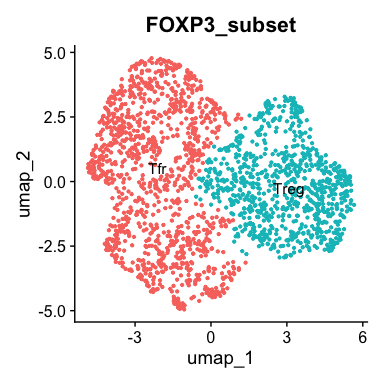
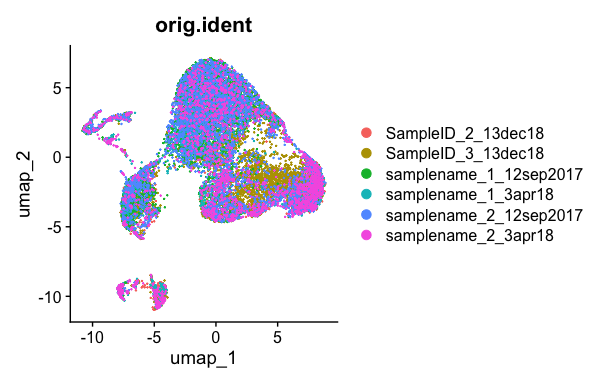
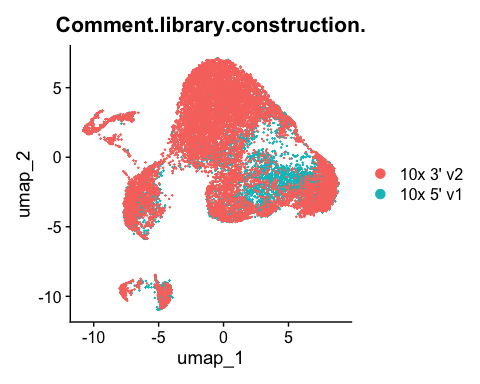
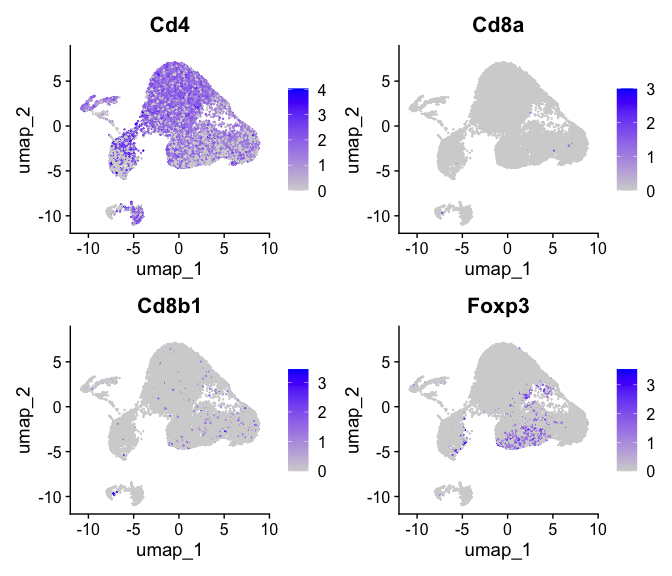
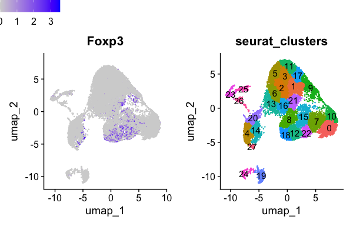
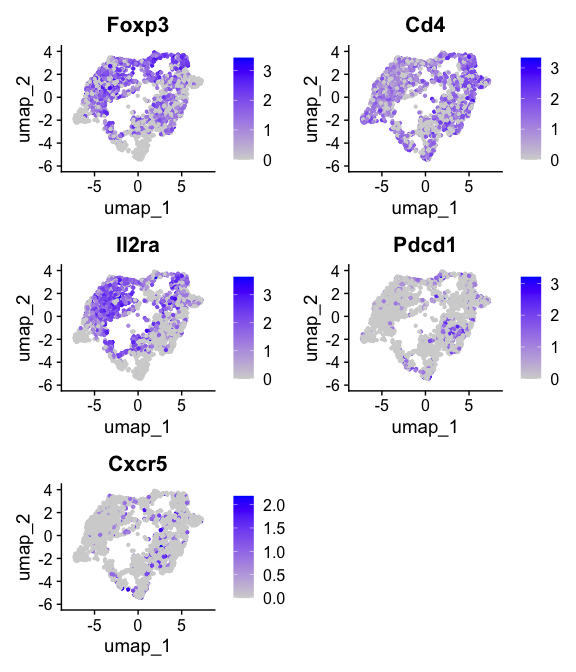
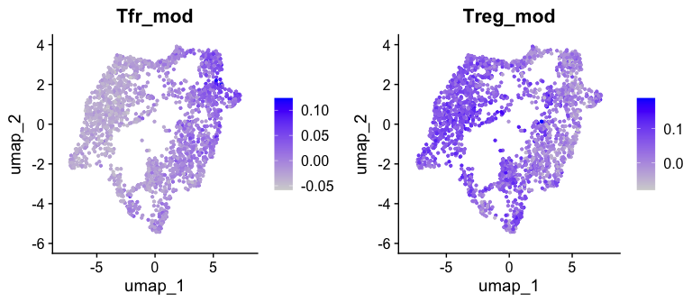
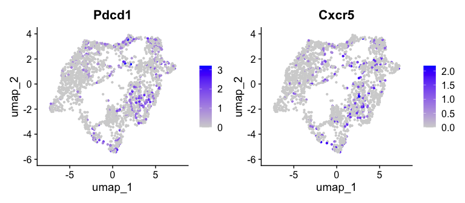
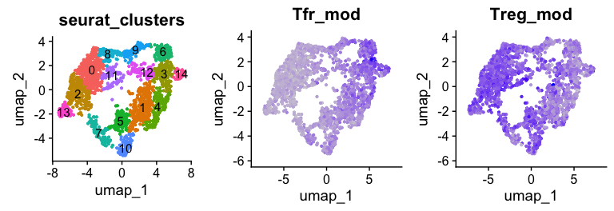
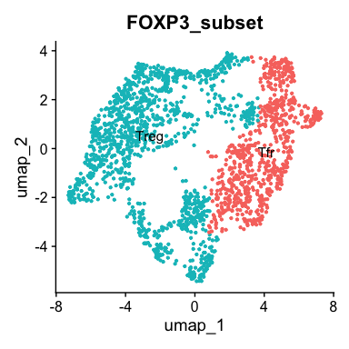

E-MTAB-11805 scRNA-Seq processing
================
Slim FOURATI
2024-04-29

Load required packages

``` r
suppressPackageStartupMessages(library(package = "knitr"))
# install.packages("hdf5r", configure.args = "--with-hdf5=/opt/homebrew/bin/h5cc")
suppressPackageStartupMessages(library(package = "hdf5r"))
suppressPackageStartupMessages(library(package = "Seurat"))
suppressPackageStartupMessages(library(package = "biomaRt"))
suppressPackageStartupMessages(library(package = "readxl"))
suppressPackageStartupMessages(library(package = "harmony"))
suppressPackageStartupMessages(library(package = "ggpubr"))
suppressPackageStartupMessages(library(package = "tidyverse"))
```

``` r
opts_chunk$set(echo = TRUE, fig.path = "../figure/")
options(readr.show_col_types   = FALSE,
        dplyr.summarise.inform = FALSE)
workDir <- dirname(getwd())
```

``` r
seqFiles <- list.files(path       = file.path(workDir, "input"), 
                       full.names = TRUE,
                       pattern = ".+h5$")
seuratObj <- NULL
for (seqFile in seqFiles) {
    seuratTemp <- Read10X_h5(filename = seqFile)
    sampleId <- gsub(pattern     = "\\..+",
                     replacement = "",
                     basename(seqFile))
    seuratTemp <- CreateSeuratObject(seuratTemp, 
                                     project = sampleId)
    seuratTemp <- RenameCells(seuratTemp,
                              new.names = paste0(sampleId,
                                                 "_",
                                                 colnames(seuratTemp)))
    seuratTemp <- DietSeurat(seuratTemp)

    if (is.null(seuratObj)) {
        seuratObj <- seuratTemp
    } else {
        seuratObj <- merge(x = seuratObj, y = seuratTemp)
        seuratObj <- JoinLayers(seuratObj)
    }
}
save(seuratObj, file = file.path(workDir, "output/e-mtab-11805.seuratObj.RData"))
```

``` r
rm(seuratTemp)
```

# Append meta-data

from ArrayExpress

``` r
aeMetaDF <- read_tsv(file = file.path(workDir, "input/E-MTAB-11805.sdrf.txt")) %>%
  mutate(orig.ident = gsub(pattern = "_S[0-9].+fastq.gz", replacement = "", basename(`Comment[FASTQ_URI]`))) %>%
  select(orig.ident,
         `Characteristics[individual]`,
         `Characteristics[stimulus]`,
         `Characteristics[organism part]`,
         `Characteristics[cell type]`,
         `Comment[library construction]`) %>%
  distinct()

metaDF <- seuratObj@meta.data %>% 
  rowid_to_column() %>%
  merge(y = aeMetaDF, by = "orig.ident", all.x = TRUE) %>%
  arrange(rowid) %>%
  `rownames<-`(value = colnames(seuratObj)) %>%
  select(-rowid) %>%
  setNames(nm = make.names(names(.)))
seuratObj@meta.data <- metaDF
save(seuratObj, file = file.path(workDir, "output/e-mtab-11805.seuratObj.RData"))
```

from Gribonika et al Table S1

``` r
s1DF <- read_excel(path = file.path(workDir, "input/sciimmunol.abc5500_data_file_s1.xlsx"))
```

# Quality control

Percentage of mitochondrial reads

``` r
ensembl <- useMart(biomart = "ensembl", dataset="mmusculus_gene_ensembl")
gene2chr <- getBM(attributes = c("mgi_symbol", "chromosome_name"), 
                  filters = "mgi_symbol", 
                  values = rownames(seuratObj$RNA), 
                  mart = ensembl)

mito.genes <- filter(gene2chr, chromosome_name %in% "MT") %>%
  .$mgi_symbol

percent.mito <- Matrix::colSums(seuratObj[["RNA"]]$counts[mito.genes, ])/
  Matrix::colSums(seuratObj[["RNA"]]$counts)

# AddMetaData adds columns to object@meta.data, and is a great place to
seuratObj <- AddMetaData(object   = seuratObj,
                         metadata = percent.mito,
                         col.name = "percent.mito")
save(seuratObj, file = file.path(workDir, "output/e-mtab-11805.seuratObj.RData"))
```

``` r
ggplot(data    = seuratObj@meta.data,
       mapping = aes(x = orig.ident, y = percent.mito)) +
  geom_boxplot() +
  scale_y_continuous(labels = scales::percent) +
  labs(y = "Percentage of reads that are mitochondrial") +
  theme_bw() + 
  theme(axis.text.x = element_text(angle = 45, hjust = 1))
```

<!-- -->

Percent of ribosomal reads

``` r
# look at ribosomal genes
ribo.genes <- grep(pattern = "^Rps|^Rpl", 
                   rownames(x = seuratObj[["RNA"]]$counts), 
                   value   = TRUE)
percent.ribo <- Matrix::colSums(seuratObj[["RNA"]]$counts[ribo.genes, ])/Matrix::colSums(seuratObj[["RNA"]]$counts)

# AddMetaData adds columns to object@meta.data, and is a great place to
seuratObj <- AddMetaData(object   = seuratObj,
                         metadata = percent.ribo,
                         col.name = "percent.ribo")
save(seuratObj, file = file.path(workDir, "output/e-mtab-11805.seuratObj.RData"))
```

``` r
ggplot(data    = seuratObj@meta.data,
       mapping = aes(x = orig.ident, y = percent.ribo)) +
  geom_boxplot() +
  theme_bw() + 
  theme(axis.text.x = element_text(angle = 45, hjust = 1))
```

<!-- -->

Number of cell detected

``` r
nbCellDF <- table(seuratObj@meta.data$orig.ident) %>%
  as.data.frame() %>%
  rename(orig.ident                  = Var1,
         `Estimated Number of Cells` = Freq)
meanReadsPerCellDF <- colSums(seuratObj[["RNA"]]$counts) %>%
  data.frame(eta = .) %>%
  rownames_to_column() %>%
  mutate(orig.ident = seuratObj@meta.data$orig.ident) %>%
  group_by(orig.ident) %>%
  summarize(`Mean Reads per Cell` = mean(eta))
medianGenesPerCell <- colSums(seuratObj$RNA$counts > 0) %>%
  data.frame(eta = .) %>%
  rownames_to_column() %>%
  mutate(orig.ident = seuratObj@meta.data$orig.ident) %>%
  group_by(orig.ident) %>%
  summarize(`Median Genes per Cell` = median(eta))

plotDF <- merge(x    = nbCellDF,
                y    = meanReadsPerCellDF,
                by   = "orig.ident") %>%
  merge(y  = medianGenesPerCell,
        by = "orig.ident") %>%
  pivot_longer(cols = -orig.ident)

ggplot(data = plotDF,
       mapping = aes(x = orig.ident, y = value)) +
  geom_bar(stat = "identity") +
  facet_grid(rows = ~name, scale = "free", space = "free_x") +
  theme_bw() +
  theme(axis.text.x = element_text(angle = 90, hjust = 1, vjust = 0.5))
```


``` r
plotDF %>%
  group_by(name) %>%
  summarize(median  = median(value),
            min     = min(value),
            max     = max(value)) %>%
  rename(metric = name) %>%
  kable()
```

| metric                    |   median |      min |      max |
|:--------------------------|---------:|---------:|---------:|
| Estimated Number of Cells | 3830.500 |  841.000 | 7734.000 |
| Mean Reads per Cell       | 5235.971 | 3487.064 | 7345.313 |
| Median Genes per Cell     | 1987.750 | 1502.000 | 2357.000 |

# Dimension reduction

``` r
DefaultAssay(seuratObj) <- "RNA"
seuratObj <- NormalizeData(seuratObj, verbose = FALSE) %>% 
    FindVariableFeatures(verbose = FALSE) %>% 
    ScaleData(verbose = FALSE) %>% 
    RunPCA(verbose = FALSE)
seuratObj <- RunUMAP(seuratObj, dims = 1:10, n.components = 2L, verbose = FALSE) 
save(seuratObj, file = file.path(workDir, "output/e-mtab-11805.seuratObj.RData"))
```

UMAP with cells colored by sample id

``` r
DimPlot(seuratObj, reduction = "umap")
```

<!-- -->

UMAP with cells colored by 3’ or 5’ seq

``` r
DimPlot(seuratObj, reduction = "umap", group.by = "Comment.library.construction.")
```

<!-- -->

UMAP with cells colored by stim

``` r
DimPlot(seuratObj, reduction = "umap", group.by = "Characteristics.cell.type.", split.by = "Comment.library.construction.")
```

<!-- --> Cells segregate by type of
sequencing (5’ vs 3’) and by stimuli (unstim vs Ag-specific). Cells will
be seperated by stim and the harmony method will be used to remove the
technical effect of using different sequencing technology.

# Data integration by CCA T cells

``` r
Idents(seuratObj) <- seuratObj$Characteristics.cell.type.
tcellObj <- subset(seuratObj, ident = "CD3+ T cell")
tcellObj[["RNA"]] <- split(tcellObj[["RNA"]], f = tcellObj$orig.ident)
tcellObj <- NormalizeData(tcellObj, verbose = FALSE)
tcellObj <- FindVariableFeatures(tcellObj, verbose = FALSE)
tcellObj <- ScaleData(tcellObj, verbose = FALSE)
tcellObj <- RunPCA(tcellObj, verbose = FALSE)
tcellObj <- IntegrateLayers(object         = tcellObj, 
                            method         = CCAIntegration, 
                            orig.reduction = "pca", 
                            new.reduction  = "integrated.cca",
                            verbose        = FALSE)

tcellObj[["RNA"]] <- JoinLayers(tcellObj[["RNA"]])
tcellObj <- RunUMAP(tcellObj, dims = 1:10, n.components = 2L, reduction = "integrated.cca", verbose = FALSE)
save(tcellObj, file = file.path(workDir, "output/tcellObj.cca.RData"))
```

UMAP with cells colored by sample id

``` r
DimPlot(tcellObj, reduction = "umap", group.by = "orig.ident")
```

<!-- -->

UMAP with cells colored by seq technology

``` r
DimPlot(tcellObj, reduction = "umap", group.by = "Comment.library.construction.")
```

<!-- -->

Expression of canonical markers (Cd4, Cd8, Foxp3)

``` r
FeaturePlot(object = tcellObj,
                     features = c("Cd4", "Cd8a", "Cd8b1", "Foxp3"))
```


There is a cluster of Foxp3 expressing cells among Cd4 T cells

Identify cluster of Foxp3 expressing cells

``` r
tcellObj <- FindNeighbors(tcellObj, reduction = "umap", dims = 1:2, verbose = FALSE)
tcellObj <- FindClusters(tcellObj, resolution = 0.5, verbose = FALSE)
save(tcellObj, file = file.path(workDir, "output/tcellObj.cca.RData"))
```

``` r
plotTfoxp3 <- FeaturePlot(object = tcellObj, features = "Foxp3") +
  theme(legend.position = "bottom")

plotTcluster <- DimPlot(object = tcellObj, group.by = "seurat_clusters", label = TRUE) +
  theme(legend.position = "none")
ggarrange(plotTfoxp3, plotTcluster, common.legend = TRUE)
```


Clusters 14, 18, 23, 24 express Foxp3.

# Extract Foxp3 expressing cells

``` r
# FOXP3 pos: 14, 18, 23, 24
Idents(tcellObj) <- tcellObj$seurat_clusters
foxp3Obj <- subset(tcellObj, idents = c(14, 18, 23, 24)) 
foxp3Obj <- foxp3Obj %>%
  RunPCA(verbose = FALSE) %>%
  RunUMAP(dims = 1:10, n.components = 2L, verbose = FALSE)
save(foxp3Obj, file = file.path(workDir, "output/foxp3Obj.unstim.RData"))
```

``` r
FeaturePlot(foxp3Obj, feature = c("Foxp3", "Cd4", "Il2ra", "Pdcd1", "Cxcr5"))
```

<!-- -->

# Identify TFR

Use Le Coz C et al DEG to distinguish Foxp3 cells into Treg and Tfr

``` r
degDF <- read_csv(file = file.path(workDir, "output/gse214572.deg_treg_tfr.csv"))
human <- useMart(biomart = "ensembl", 
                 dataset = "hsapiens_gene_ensembl",
                 host    = "https://dec2021.archive.ensembl.org/")
mouse <- useMart(biomart = "ensembl", 
                 dataset="mmusculus_gene_ensembl",
                 host    = "https://dec2021.archive.ensembl.org/")
human2mouse <- getLDS(mart = human, attributes = "hgnc_symbol", 
                      filters = "hgnc_symbol", values = degDF$values, 
                      attributesL = "mgi_symbol", martL = mouse)

featLS <- merge(x = degDF, y = human2mouse, by.x = "values", by.y = "HGNC.symbol") %>%
  select(MGI.symbol, ind) %>%
  unstack()

foxp3Obj <- AddModuleScore(foxp3Obj,
                            features = featLS,
                            name     = "Module")
foxp3Obj$Tfr_mod <- foxp3Obj$Module1
foxp3Obj$Treg_mod <- foxp3Obj$Module2
foxp3Obj$Module1 <- NULL
foxp3Obj$Module2 <- NULL
save(foxp3Obj, file = file.path(workDir, "output/foxp3Obj.unstim.RData"))
```

UMAP plotting the expression of Tfr and Treg signatures from Le Coz C et
al dataset

``` r
plotTregTfr <- FeaturePlot(foxp3Obj, features = c("Tfr_mod", "Treg_mod"), combine = FALSE)
ggarrange(plotTregTfr[[1]], plotTregTfr[[2]])
```

<!-- -->

``` r
# look at Flow markers of Tfr
FeaturePlot(foxp3Obj, features = c("Pdcd1", "Cxcr5"))
```

<!-- -->

Clustering of Foxp3 expressing cells and seperation of Treg and Tfr

``` r
foxp3Obj <- FindNeighbors(foxp3Obj, reduction = "umap", dims = 1:2, verbose = FALSE)
foxp3Obj <- FindClusters(foxp3Obj, resolution = 0.5, verbose = FALSE)
save(foxp3Obj, file = file.path(workDir, "output/foxp3Obj.unstim.RData"))
```

``` r
plotFoxp3Cluster <- DimPlot(foxp3Obj, group.by = "seurat_clusters", label = TRUE) +
  theme(legend.position = "none")
ggarrange(plotFoxp3Cluster, plotTregTfr[[1]], plotTregTfr[[2]], legend = FALSE, nrow = 1)
```


Clusters 1, 5, 6, 7, 10 are Tregs.

Add Treg/Tfr labels

``` r
foxp3Obj <- AddMetaData(foxp3Obj,
                        metadata = ifelse(test = foxp3Obj$seurat_clusters %in% c(1, 5, 6, 7, 10),
                                          yes  = "Treg",
                                          no   = "Tfr"),
                        col.name = "FOXP3_subset")
save(foxp3Obj, file = file.path(workDir, "output/foxp3Obj.unstim.RData"))
```

``` r
DimPlot(foxp3Obj, group.by = "FOXP3_subset", label = TRUE) +
  theme(legend.position = "none")
```

<!-- -->

# Data integration by CCA stimulated T

``` r
Idents(seuratObj) <- seuratObj$Characteristics.cell.type.
stimObj <- subset(seuratObj, ident = "CTB tetramer binding T cell")
stimObj[["RNA"]] <- split(stimObj[["RNA"]], f = stimObj$orig.ident)
stimObj <- NormalizeData(stimObj, verbose = FALSE)
stimObj <- FindVariableFeatures(stimObj, verbose = FALSE)
stimObj <- ScaleData(stimObj, verbose = FALSE)
stimObj <- RunPCA(stimObj, verbose = FALSE)
stimObj <- IntegrateLayers(object         = stimObj, 
                            method         = CCAIntegration, 
                            orig.reduction = "pca", 
                            new.reduction  = "integrated.cca",
                            verbose = FALSE)

stimObj[["RNA"]] <- JoinLayers(stimObj[["RNA"]])
stimObj <- RunUMAP(stimObj, dims = 1:10, n.components = 2L, reduction = "integrated.cca", verbose = FALSE)
save(stimObj, file = file.path(workDir, "output/stimObj.cca.RData"))
```

UMAP with cells colored by sample id

``` r
DimPlot(stimObj, reduction = "umap", group.by = "orig.ident")
```

<!-- -->

UMAP with cells colored by seq technology

``` r
DimPlot(stimObj, reduction = "umap", group.by = "Comment.library.construction.")
```

<!-- -->

Expression of canonical markers (Cd4, Cd8, Foxp3)

``` r
FeaturePlot(object   = stimObj,
            features = c("Cd4", "Cd8a", "Cd8b1", "Foxp3"))
```


There is a cluster of Foxp3 expressing cells among T cells

Identify cluster of Foxp3 expressing cells

``` r
stimObj <- FindNeighbors(stimObj, reduction = "umap", dims = 1:2, verbose = FALSE)
stimObj <- FindClusters(stimObj, resolution = 0.5, verbose = FALSE)
save(stimObj, file = file.path(workDir, "output/stimObj.cca.RData"))
```

``` r
plotStimfoxp3 <- FeaturePlot(object = stimObj, features = "Foxp3") +
  theme(legend.position = "bottom")

plotStimcluster <- DimPlot(object = stimObj, group.by = "seurat_clusters", label = TRUE) +
  theme(legend.position = "none")
ggarrange(plotStimfoxp3, plotStimcluster, common.legend = TRUE)
```


Clusters 12, 15, 18, 22 express Foxp3.

# Extract Foxp3 expressing cells

``` r
# FOXP3 pos: 12, 15, 18, 22
Idents(stimObj) <- stimObj$seurat_clusters
foxp3stimObj <- subset(stimObj, idents = c(12, 15, 18, 22)) 
foxp3stimObj <- foxp3stimObj %>%
  RunPCA(verbose = FALSE) %>%
  RunUMAP(dims = 1:10, n.components = 2L, verbose = FALSE)
save(foxp3stimObj, file = file.path(workDir, "output/foxp3Obj.stim.RData"))
```

``` r
FeaturePlot(foxp3stimObj, feature = c("Foxp3", "Cd4", "Il2ra", "Pdcd1", "Cxcr5"))
```

<!-- -->

# Identify TFR

Use Le Coz C et al DEG to distinguish Foxp3 cells into Treg and Tfr

``` r
degDF <- read_csv(file = file.path(workDir, "output/gse214572.deg_treg_tfr.csv"))
human <- useMart(biomart = "ensembl", 
                 dataset = "hsapiens_gene_ensembl",
                 host    = "https://dec2021.archive.ensembl.org/")
mouse <- useMart(biomart = "ensembl", 
                 dataset="mmusculus_gene_ensembl",
                 host    = "https://dec2021.archive.ensembl.org/")
human2mouse <- getLDS(mart = human, attributes = "hgnc_symbol", 
                      filters = "hgnc_symbol", values = degDF$values, 
                      attributesL = "mgi_symbol", martL = mouse)

featLS <- merge(x = degDF, y = human2mouse, by.x = "values", by.y = "HGNC.symbol") %>%
  select(MGI.symbol, ind) %>%
  unstack()

foxp3stimObj <- AddModuleScore(foxp3stimObj,
                            features = featLS,
                            name     = "Module")
foxp3stimObj$Tfr_mod <- foxp3stimObj$Module1
foxp3stimObj$Treg_mod <- foxp3stimObj$Module2
foxp3stimObj$Module1 <- NULL
foxp3stimObj$Module2 <- NULL
save(foxp3stimObj, file = file.path(workDir, "output/foxp3Obj.stim.RData"))
```

UMAP plotting the expression of Tfr and Treg signatures from Le Coz C et
al dataset

``` r
plotStimTregTfr <- FeaturePlot(foxp3stimObj, features = c("Tfr_mod", "Treg_mod"), combine = FALSE)
ggarrange(plotStimTregTfr[[1]], plotStimTregTfr[[2]])
```

<!-- -->

``` r
# look at Flow markers of Tfr
FeaturePlot(foxp3stimObj, features = c("Pdcd1", "Cxcr5"))
```

<!-- -->

Clustering of Foxp3 expressing cells and seperation of Treg and Tfr

``` r
foxp3stimObj <- FindNeighbors(foxp3stimObj, reduction = "umap", dims = 1:2, verbose = FALSE)
foxp3stimObj <- FindClusters(foxp3stimObj, resolution = 0.5, verbose = FALSE)
save(foxp3stimObj, file = file.path(workDir, "output/foxp3Obj.stim.RData"))
```

``` r
plotStimFoxp3Cluster <- DimPlot(foxp3stimObj, group.by = "seurat_clusters", label = TRUE) +
  theme(legend.position = "none")
ggarrange(plotStimFoxp3Cluster, plotStimTregTfr[[1]], plotStimTregTfr[[2]], legend = FALSE, nrow = 1)
```


Clusters 1, 3, 4, 6, 14 are Tfrs.

Add Treg/Tfr labels

``` r
foxp3stimObj <- AddMetaData(foxp3stimObj,
                            metadata = ifelse(test = foxp3stimObj$seurat_clusters %in% c(1, 3, 4, 6, 14),
                                              yes  = "Tfr",
                                              no   = "Treg"),
                            col.name = "FOXP3_subset")
save(foxp3stimObj, file = file.path(workDir, "output/foxp3Obj.stim.RData"))
```

``` r
DimPlot(foxp3stimObj, group.by = "FOXP3_subset", label = TRUE) +
  theme(legend.position = "none")
```

<!-- -->

# Session Info

``` r
sessionInfo()
```

    ## R version 4.4.0 (2024-04-24)
    ## Platform: aarch64-apple-darwin23.4.0
    ## Running under: macOS Sonoma 14.4.1
    ## 
    ## Matrix products: default
    ## BLAS:   /opt/homebrew/Cellar/openblas/0.3.27/lib/libopenblasp-r0.3.27.dylib 
    ## LAPACK: /opt/homebrew/Cellar/r/4.4.0/lib/R/lib/libRlapack.dylib;  LAPACK version 3.12.0
    ## 
    ## locale:
    ## [1] en_US.UTF-8/en_US.UTF-8/en_US.UTF-8/C/en_US.UTF-8/en_US.UTF-8
    ## 
    ## time zone: America/Chicago
    ## tzcode source: internal
    ## 
    ## attached base packages:
    ## [1] stats     graphics  grDevices utils     datasets  methods   base     
    ## 
    ## other attached packages:
    ##  [1] lubridate_1.9.3    forcats_1.0.0      stringr_1.5.1      dplyr_1.1.4       
    ##  [5] purrr_1.0.2        readr_2.1.5        tidyr_1.3.1        tibble_3.2.1      
    ##  [9] tidyverse_2.0.0    ggpubr_0.6.0       ggplot2_3.5.1      harmony_1.2.0     
    ## [13] Rcpp_1.0.12        readxl_1.4.3       biomaRt_2.59.1     Seurat_5.0.3      
    ## [17] SeuratObject_5.0.1 sp_2.1-3           hdf5r_1.3.10       knitr_1.46        
    ## 
    ## loaded via a namespace (and not attached):
    ##   [1] RcppAnnoy_0.0.22        splines_4.4.0           later_1.3.2            
    ##   [4] filelock_1.0.3          cellranger_1.1.0        polyclip_1.10-6        
    ##   [7] fastDummies_1.7.3       lifecycle_1.0.4         httr2_1.0.1            
    ##  [10] rstatix_0.7.2           globals_0.16.3          lattice_0.22-6         
    ##  [13] MASS_7.3-60.2           backports_1.4.1         magrittr_2.0.3         
    ##  [16] plotly_4.10.4           rmarkdown_2.26          yaml_2.3.8             
    ##  [19] httpuv_1.6.15           sctransform_0.4.1       spam_2.10-0            
    ##  [22] spatstat.sparse_3.0-3   reticulate_1.36.1       cowplot_1.1.3          
    ##  [25] pbapply_1.7-2           DBI_1.2.2               RColorBrewer_1.1-3     
    ##  [28] abind_1.4-5             zlibbioc_1.49.3         Rtsne_0.17             
    ##  [31] BiocGenerics_0.49.1     rappdirs_0.3.3          GenomeInfoDbData_1.2.12
    ##  [34] IRanges_2.37.1          S4Vectors_0.41.7        ggrepel_0.9.5          
    ##  [37] irlba_2.3.5.1           listenv_0.9.1           spatstat.utils_3.0-4   
    ##  [40] goftest_1.2-3           RSpectra_0.16-1         spatstat.random_3.2-3  
    ##  [43] fitdistrplus_1.1-11     parallelly_1.37.1       leiden_0.4.3.1         
    ##  [46] codetools_0.2-20        xml2_1.3.6              tidyselect_1.2.1       
    ##  [49] farver_2.1.1            UCSC.utils_0.99.7       matrixStats_1.3.0      
    ##  [52] stats4_4.4.0            BiocFileCache_2.11.2    spatstat.explore_3.2-7 
    ##  [55] jsonlite_1.8.8          progressr_0.14.0        ggridges_0.5.6         
    ##  [58] survival_3.6-4          tools_4.4.0             progress_1.2.3         
    ##  [61] ica_1.0-3               glue_1.7.0              gridExtra_2.3          
    ##  [64] xfun_0.43               GenomeInfoDb_1.39.14    withr_3.0.0            
    ##  [67] fastmap_1.1.1           fansi_1.0.6             digest_0.6.35          
    ##  [70] timechange_0.3.0        R6_2.5.1                mime_0.12              
    ##  [73] colorspace_2.1-0        scattermore_1.2         tensor_1.5             
    ##  [76] spatstat.data_3.0-4     RSQLite_2.3.6           utf8_1.2.4             
    ##  [79] generics_0.1.3          data.table_1.15.4       prettyunits_1.2.0      
    ##  [82] httr_1.4.7              htmlwidgets_1.6.4       uwot_0.2.2             
    ##  [85] pkgconfig_2.0.3         gtable_0.3.5            blob_1.2.4             
    ##  [88] lmtest_0.9-40           XVector_0.43.1          htmltools_0.5.8.1      
    ##  [91] carData_3.0-5           dotCall64_1.1-1         scales_1.3.0           
    ##  [94] Biobase_2.63.1          png_0.1-8               rstudioapi_0.16.0      
    ##  [97] tzdb_0.4.0              reshape2_1.4.4          nlme_3.1-164           
    ## [100] curl_5.2.1              cachem_1.0.8            zoo_1.8-12             
    ## [103] KernSmooth_2.23-22      parallel_4.4.0          miniUI_0.1.1.1         
    ## [106] AnnotationDbi_1.65.2    pillar_1.9.0            grid_4.4.0             
    ## [109] vctrs_0.6.5             RANN_2.6.1              promises_1.3.0         
    ## [112] car_3.1-2               dbplyr_2.5.0            xtable_1.8-4           
    ## [115] cluster_2.1.6           evaluate_0.23           cli_3.6.2              
    ## [118] compiler_4.4.0          rlang_1.1.3             crayon_1.5.2           
    ## [121] future.apply_1.11.2     ggsignif_0.6.4          labeling_0.4.3         
    ## [124] plyr_1.8.9              stringi_1.8.3           viridisLite_0.4.2      
    ## [127] deldir_2.0-4            munsell_0.5.1           Biostrings_2.71.6      
    ## [130] lazyeval_0.2.2          spatstat.geom_3.2-9     Matrix_1.7-0           
    ## [133] RcppHNSW_0.6.0          hms_1.1.3               patchwork_1.2.0        
    ## [136] bit64_4.0.5             future_1.33.2           KEGGREST_1.43.1        
    ## [139] shiny_1.8.1.1           highr_0.10              ROCR_1.0-11            
    ## [142] igraph_2.0.3            broom_1.0.5             memoise_2.0.1          
    ## [145] bit_4.0.5
