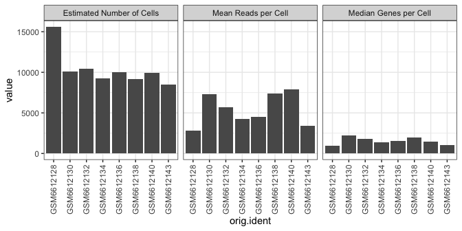

GSE214572 scRNA-Seq processing
================
Slim Fourati
2024-04-30

Load required packages

``` r
suppressPackageStartupMessages(library(package = "knitr"))
suppressPackageStartupMessages(library(package = "Seurat"))
suppressPackageStartupMessages(library(package = "biomaRt"))
suppressPackageStartupMessages(library(package = "ggpubr"))
suppressPackageStartupMessages(library(package = "presto"))
suppressPackageStartupMessages(library(package = "tidyverse"))
```

``` r
opts_chunk$set(echo = TRUE, fig.path = "../figure/")
options(readr.show_col_types   = FALSE,
        dplyr.summarise.inform = FALSE)
workDir <- dirname(getwd())
```

# Read input file MTX

``` r
mtxFiles <- list.files(path       = file.path(workDir, "input"), 
                       full.names = TRUE,
                       pattern = "matrix.mtx.gz$")
seuratObj <- NULL
for (mtxFile in mtxFiles) {
  seuratTemp <- ReadMtx(mtx = mtxFile,
        cells = gsub(pattern = "matrix.mtx.gz", "barcodes.tsv.gz", mtxFile),
        features = gsub(pattern = "matrix.mtx.gz", "features.tsv.gz", mtxFile)) 
  sampleId <- gsub(pattern = "_.+", replacement = "", basename(mtxFile))
    seuratTemp <- CreateSeuratObject(seuratTemp, 
                                     project = sampleId)
    seuratTemp <- RenameCells(seuratTemp,
                              new.names = paste0(sampleId,
                                                 "_",
                                                 colnames(seuratTemp)))
    seuratTemp <- DietSeurat(seuratTemp)
    
       if (is.null(seuratObj)) {
        seuratObj <- seuratTemp
    } else {
        seuratObj <- merge(x = seuratObj, y = seuratTemp)
        seuratObj <- JoinLayers(seuratObj)
    }
}
save(seuratObj, file = file.path(workDir, "output/gse214572.seuratObj.RData"))
```

``` r
rm(seuratTemp)
```

# Append meta-data

``` r
mtxFiles <- list.files(path       = file.path(workDir, "input"), 
                       full.names = TRUE,
                       pattern = "matrix.mtx.gz$")
metaDF <- basename(mtxFiles) %>%
  gsub(pattern = "5GEX_matrix.mtx.gz", replacement = "") %>%
  strsplit(split = "_") %>%
  do.call(what = rbind) %>%
  as.data.frame() %>%
  setNames(nm = c("orig.ident", "donor", "subset"))

seuratObj@meta.data %>% 
  rowid_to_column() %>%
  merge(y = metaDF, by = "orig.ident", all.x = TRUE) %>%
  arrange(rowid) %>%
  `rownames<-`(value = colnames(seuratObj)) %>%
  select(-rowid) %>%
  setNames(nm = make.names(names(.))) -> metaDF
seuratObj@meta.data <- metaDF
save(seuratObj, file = file.path(workDir, "output/gse214572.seuratObj.RData"))
```

# Quality control

Percentage of mitochondrial reads

``` r
ensembl <- useMart(biomart = "ensembl", dataset="hsapiens_gene_ensembl")
gene2chr <- getBM(attributes = c("hgnc_symbol", "chromosome_name"), 
                  filters    = "hgnc_symbol", 
                  values     = rownames(seuratObj$RNA), 
                  mart       = ensembl)

mito.genes <- filter(gene2chr, chromosome_name %in% "MT") %>%
  .$hgnc_symbol

percent.mito <- Matrix::colSums(seuratObj[["RNA"]]$counts[mito.genes, ])/
  Matrix::colSums(seuratObj[["RNA"]]$counts)

# AddMetaData adds columns to object@meta.data, and is a great place to
seuratObj <- AddMetaData(object   = seuratObj,
                         metadata = percent.mito,
                         col.name = "percent.mito")
save(seuratObj, file = file.path(workDir, "output/gse214572.seuratObj.RData"))
```

``` r
ggplot(data    = seuratObj@meta.data,
       mapping = aes(x = orig.ident, y = percent.mito)) +
  geom_boxplot() +
  scale_y_continuous(labels = scales::percent) +
  labs(y = "Percentage of reads that are mitochondrial") +
  theme_bw() + 
  theme(axis.text.x = element_text(angle = 45, hjust = 1))
```

<!-- -->

Percent of ribosomal reads

``` r
# look at ribosomal genes
ribo.genes <- grep(pattern = "^RPS|^RPL", 
                   rownames(x = seuratObj[["RNA"]]$counts), 
                   value   = TRUE)
percent.ribo <- Matrix::colSums(seuratObj[["RNA"]]$counts[ribo.genes, ])/Matrix::colSums(seuratObj[["RNA"]]$counts)

# AddMetaData adds columns to object@meta.data, and is a great place to
seuratObj <- AddMetaData(object   = seuratObj,
                         metadata = percent.ribo,
                         col.name = "percent.ribo")
save(seuratObj, file = file.path(workDir, "output/gse214572.seuratObj.RData"))
```

``` r
ggplot(data    = seuratObj@meta.data,
       mapping = aes(x = orig.ident, y = percent.ribo)) +
  geom_boxplot() +
  theme_bw() + 
  theme(axis.text.x = element_text(angle = 45, hjust = 1))
```

<!-- -->

Number of cell detected

``` r
nbCellDF <- table(seuratObj@meta.data$orig.ident) %>%
  as.data.frame() %>%
  rename(orig.ident                  = Var1,
         `Estimated Number of Cells` = Freq)
meanReadsPerCellDF <- colSums(seuratObj[["RNA"]]$counts) %>%
  data.frame(eta = .) %>%
  rownames_to_column() %>%
  mutate(orig.ident = seuratObj@meta.data$orig.ident) %>%
  group_by(orig.ident) %>%
  summarize(`Mean Reads per Cell` = mean(eta))
medianGenesPerCell <- colSums(seuratObj$RNA$counts > 0) %>%
  data.frame(eta = .) %>%
  rownames_to_column() %>%
  mutate(orig.ident = seuratObj@meta.data$orig.ident) %>%
  group_by(orig.ident) %>%
  summarize(`Median Genes per Cell` = median(eta))

plotDF <- merge(x    = nbCellDF,
                y    = meanReadsPerCellDF,
                by   = "orig.ident") %>%
  merge(y  = medianGenesPerCell,
        by = "orig.ident") %>%
  pivot_longer(cols = -orig.ident)

ggplot(data = plotDF,
       mapping = aes(x = orig.ident, y = value)) +
  geom_bar(stat = "identity") +
  facet_grid(rows = ~name, scale = "free", space = "free_x") +
  theme_bw() +
  theme(axis.text.x = element_text(angle = 90, hjust = 1, vjust = 0.5))
```



``` r
plotDF %>%
  group_by(name) %>%
  summarize(median  = median(value),
            min     = min(value),
            max     = max(value)) %>%
  rename(metric = name) %>%
  kable()
```

| metric                    |   median |      min |       max |
|:--------------------------|---------:|---------:|----------:|
| Estimated Number of Cells | 9967.500 | 8512.000 | 15598.000 |
| Mean Reads per Cell       | 5077.677 | 2840.478 |  7922.838 |
| Median Genes per Cell     | 1473.500 |  932.000 |  2234.000 |

# Dimension reduction

``` r
DefaultAssay(seuratObj) <- "RNA"
seuratObj <- NormalizeData(seuratObj, verbose = FALSE) %>% 
    FindVariableFeatures(verbose = FALSE) %>% 
    ScaleData(verbose = FALSE) %>% 
    RunPCA(verbose = FALSE)

seuratObj <- RunUMAP(seuratObj, dims = 1:10, n.components = 2L, verbose = FALSE) 
save(seuratObj, file = file.path(workDir, "output/gse214572.seuratObj.RData"))
```

UMAP with cells colored by sample id

``` r
DimPlot(seuratObj, reduction = "umap")
```

<!-- -->

UMAP with cells colored by donor

``` r
DimPlot(seuratObj, reduction = "umap", group.by = "donor")
```

<!-- -->

UMAP with cells colored by sorted subset

``` r
DimPlot(seuratObj, reduction = "umap", group.by = "subset", split.by = "donor")
```

<!-- -->

Violin plot of markers used for flow sorting

``` r
Idents(seuratObj) <- interaction(seuratObj$donor,
                                 seuratObj$subset,
                                 drop = TRUE)
VlnPlot(seuratObj, feature = c("FOXP3", "CD4", "IL2RA", "PDCD1", "CXCR5"))
```


UMAP flow sorting markers

``` r
plotSubset <- DimPlot(seuratObj, reduction = "umap", group.by = "subset")
plotMarkers <- FeaturePlot(seuratObj, features = c("PDCD1", "CXCR5"), combine = FALSE)
ggarrange(plotSubset, plotMarkers[[1]], plotMarkers[[2]], legend = "bottom", nrow = 1)
```

<!-- -->

# Differential expression by donor

``` r
Idents(seuratObj) <- interaction(seuratObj$donor,
                                 seuratObj$subset,
                                 drop = TRUE)
topDonor1 <- FindMarkers(seuratObj,
                    ident.1 = "TC174.TFR",
                    ident.2 = "TC174.TREG",
                    logfc.threshold = 1)
topDonor2 <- FindMarkers(seuratObj,
                    ident.1 = "TC341.TFR",
                    ident.2 = "TC341.TREG",
                    logfc.threshold = 1)
topIntersect <- rownames_to_column(topDonor1, var = "gene_name") %>%
  merge(y  = rownames_to_column(topDonor2, var = "gene_name"),
        by = "gene_name") %>%
  filter(sign(avg_log2FC.x) == sign(avg_log2FC.y))

featLS <- split(topIntersect$gene_name, f = sign(topIntersect$avg_log2FC.x)) %>%
  setNames(nm = c("TREG", "TFR"))
# append average expression of gene to seurat object
seuratObj <- AddModuleScore(seuratObj,
                            features = featLS,
                            name     = "Feat")
seuratObj$Treg_mod <- seuratObj$Feat1
seuratObj$Tfr_mod <- seuratObj$Feat2
seuratObj$Feat1 <- NULL
seuratObj$Feat2 <- NULL
save(seuratObj, file = file.path(workDir, "output/gse214572.seuratObj.RData"))
# write feature list
write_csv(stack(featLS), file = file.path(workDir, "output/gse214572.deg_treg_tfr.csv"))
```

UMAP of module score

``` r
plotMod <- FeaturePlot(seuratObj, features = c("Treg_mod", "Tfr_mod"), combine = FALSE)

ggarrange(plotSubset, plotMod[[1]], plotMod[[2]], legend = "bottom", nrow = 1)
```

<!-- -->
